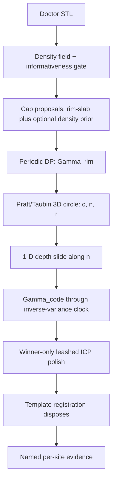

# Healing-cap curve alignment — engineering design

2026-08-15 · engineering design. The algorithm does **not** ship in this
document. It ships later, shadow-first, behind `make verify-fleet`. Companion
files: the measurement receipt
[`apps/worker/eval/probe_cap_curves.py`](../../apps/worker/eval/probe_cap_curves.py)
(Appendix A), the backlog and Loop playbook
[`healing-cap-curve-backlog.md`](healing-cap-curve-backlog.md). Read alongside
[`clinical-pipeline-plan.md`](clinical-pipeline-plan.md) Stage 1–3,
[`alignment-perfection-strategy.md`](alignment-perfection-strategy.md), and
`island.py`. Where this document disagrees with an older plan on *how to find
the rim*, this one wins; where it disagrees on *isolation / cropping*, the
clinical pipeline wins — crease is a measurement, never a crop.

---

## 0 · Honest opinion

This product is further along than a typical "we need a better algorithm"
conversation implies. The parts that usually kill dental-CAD automation are
already in the tree and defended by tests:

- **Trust architecture** is the strongest asset. Statuses and verdicts are
  server-derived; evidence is content-addressed; runs are immutable; release
  re-hashes and 409s on drift. See [`docs/ARCHITECTURE.md`](../ARCHITECTURE.md)
  §5. No new work may erode this.
- **Alignment is not a 6-DoF optimiser.** It is a chain of closed-form
  constructions (rim circle → 1-D depth → coded-face clock → leashed ICP
  polish). That is the right shape. Early trimmed ICP wandered up to 47° into
  ridge-wall basins; that scar is why ICP no longer picks the basin.
- **Detection already exists** and is a density instrument of a different kind:
  the rim-slab core/ring ratio in
  [`apps/worker/src/case_prep/adapters/cap_detection.py`](../../apps/worker/src/case_prep/adapters/cap_detection.py).
  Fleet recall is **8 of 10** sites within 2 mm. The two misses (`cap7020-t3`,
  `zimmer-t7`) are capture problems as much as detector problems.

**What will not move the needle:** a new global optimiser, learned segmentation
at this data volume, or colour-based discrimination against the files we
actually have.

**What will:** (1) treating the rim as an explicit curve instead of an implicit
scalar field, (2) stopping clicks from *being* the measurement, (3) a capture
gate that refuses a bad scan while the patient is still in the chair.

**The colour request, stated plainly.** All nine client scans under
`apps/worker/data/real/scans/` are RealGUIDE binary STL. Attribute bytes are
zero on every facet (Appendix A). The BFF upload path refuses anything that is
not `.stl`. No worker module reads `mesh.visual`. Colour is a **commercial
intake ask** (PLY/OBJ from the scanner, which already captures it), not an
engineering slice you can build this month.

**Triangle density is a real signal** on seven of ten sites (cap-local
tessellation 1.34×–4.62× finer than the tissue 6–12 mm away) and is used
**nowhere** as a feature today. It is also exporter-specific and **inverts** on
`neodent-gm` t4 (0.76×). That is the channel to build — as a prior, never a
gate.

**The crease-for-isolation trap.**
[`clinical-pipeline-plan.md`](clinical-pipeline-plan.md) Stage 2 already
**rejected** curvature segmentation for *cropping*, because tissue heals against
the cap and the boundary blends. This design reuses crease and density only to
**measure** the rim circle. Isolation stays template-matched
(`CAP_MATCH_BAND_MM = 0.6`). A curve extractor that is allowed to crop will
delete the cap on submerged sites (measured: geometric island mask alone loses
53–83% of the cap's own points on cap6020).

---

## 1 · What already exists

```
apps/product  (:5174)  →  apps/bff (:8001)  →  case_prep.application
                                                → pipeline / domain / adapters
```

Five stages (keys unchanged, titles are the client's) live in
`apps/product/src/domain/flow.ts`: Intake → Alignment (`declare`) → Adjustment
→ Construction library → Delivery.

The clinical chain this design sits in:

1. **Find** — `find_cap_sites` proposes; template registration disposes.
2. **Isolate** — honest ladder (matched → width → spherical); doctor's
   triangles, nothing moved.
3. **Align** — 3D rim circle gives axis + centre; depth is 1-D along the axis;
   clock from coded cutouts (`clock_signature.py`).
4. **Recompose / deliver** — exact-cap punch + gingival offset; open-arch
   artifacts; confirmation seals evidence.

`apps/worker/src/case_prep/domain/island.py` already extracts a machine
rim/centre and is **shadow-only** (`auto_flow.SHADOW_ISLAND`). That is the
largest piece of already-built, already-measured, unshipped value. This design
promotes and replaces its weakest instrument (`_ring_fit`'s
longest-contiguous-run heuristic, which is grid-phase bistable: cap6030 read
1.81 mm vs 2.64 mm from a 0.8 mm-degraded seed).

Do not touch `apps/web`, `case_prep.server`, or the freeze line.

---

## 2 · Business cases

Figures from [`docs/opportunity-forecast.md`](../opportunity-forecast.md):
illustrative model at ~200 implant units/month × ~$50/unit. Plug in real
volume; the multipliers travel.

- **Operator capacity.** Manual ~15 units/day → automation-assisted ~28–30.
  The bottleneck this design attacks is the morning's first minutes: "where are
  the caps, and is the scan even usable?" Detection misses (2/10) and
  click-steered seats (0.6 mm click → up to 1.09 mm / 16.6° pose) are why a
  case still needs a skilled operator.
- **Margin.** Manual ~66% gross → automation ~82% (cement-retained ~86%).
  Cement-retained is the near-zero-marginal-cost wedge *after* pose is
  trustworthy. Curve quality is upstream of that wedge.
- **Chairside recapture (the hidden P&L).** t4/t7-class scans are unrescuable
  by any curve algorithm. A capture gate that says "rescan the cheek-side rim"
  while the patient is seated is worth more than a cleverer fit on a hole.
  Industry (ZimVie coded-abutment, Atlantis) already refuses these. We already
  compute the instruments (`capture_gate.py`); they are not yet a hard intake
  refusal.
- **Colour scans as a sales/intake ask, not R&D.** Scanners capture colour
  natively. Asking shops for PLY/OBJ converts the #1 accuracy limiter (seat
  region median 54–60% tooth/gum) into an easier segmentation prior. Zero
  engineering until one real coloured doctor scan exists in the fleet.
- **Year-2 illustrative upside:** base path ~2.3× gross profit vs today; build
  payback inside about a year at the stated volumes. Those numbers assume
  automatable case mix and do **not** include standing audit-loop labour or a
  MeshLib licence —
  [`phase2-plan-grilling.md`](phase2-plan-grilling.md) already flagged that
  omission.
- **What this is not.** It is not a RealGUIDE replacement. The original thesis
  (prep around a closed CAD, import STL) is still the commercial frame. The
  RealGUIDE round-trip remains **unvalidated**. Do not sell "export and it just
  works" until that spike exists.

---

## 3 · What else is needed (the algorithm cannot substitute)

- **Printed phantom** ([`phantom-protocol.md`](phantom-protocol.md)). There is
  **no independent 6-DoF ground truth** on any real arch. Every real site's
  "truth" is the doctor's click. Until the plate comes back, any accuracy claim
  about a new curve is a comparison of two guesses. Data-science must sign
  every client-facing millimetre number.
- **Capture-gate as a hard intake refusal** for unrescuable scans (t7-class).
  Algorithm work on those sites is wasted.
- **Client texts:** Terms & Conditions and Clinical Responsibility Statement
  are still placeholders. Payment is a stub (`provider: "stub"`).
- **§10-L physical measurement** (Zimmer 4.5 / cap7030 screw-access
  disagreement) and **§10-J** ruling on the second adjustment tool.
- **N > 2 sites** has never been measured on one arch. Not known-broken —
  unmeasured.
- **Doctor vs lab-model provenance** does not exist as a field, classifier, or
  gate. `crown_up_axis` assumes outward normals face the scanner; a model
  scanned from below would flip every height test. Calibrate this on the
  phantom (printed plate scanned like a stone model vs intraoral), not by
  guessing roughness heuristics.
- **One implant system per case** and **one construction part per case** are
  standing product limits ([`ARCHITECTURE.md`](../ARCHITECTURE.md) §7).

---

## 4 · The mathematical problem

### 4.1 What we are recovering

A seated healing cap presents three curve families in its own frame:

- **Γ_rim** — closed C⁰ crease where cylindrical flank meets top face. A 3D
  circle `(c, n̂, r)` is **5 of 6 DoF** (origin, axis, radius). Depth along `n̂`
  is *not* constrained by the rim and still comes from the existing 1-D
  symmetric-score slide (`_refine_depth`).
- **Γ_recess** — screw-access void. Axisymmetric on this catalog (bore within
  0.02–0.11 mm of the rim ring). **No clock.**
- **Γ_code** — open radial trench boundaries. The **only** carriers of the 6th
  DoF. Already read on the template side as `(azimuth_deg, radius_mm)` and
  combined by inverse-variance (`observation_weight`; lever-arm law: rotation
  error scales as `1/R`).

Measured dihedral closure about curated centres (Appendix A: 24 bearings, crease
>20°, ±0.8 mm of marked rim radius): **9–24 of 24**, median **18/24**. At 30°
the median drops to 15/24. A curve extractor **must be designed for partial
arcs from line one**. The threshold is ~20°, not a sharp machining crease.

### 4.2 Stage 0 — scale-normalised geometry

On one mesh, a k-ring neighbourhood spans ~0.06 mm on a dense cap and ~0.10 mm
on tissue (Appendix A, median edge). Curvature support is a **geodesic radius
in millimetres**, never a ring count. Recommended `ρ = 0.25 mm` (below the
smallest catalog trench half-width 0.40–0.78 mm). Output: principal curvatures
`κ₁ ≥ κ₂` and directions, or the cheap measured proxy: per-edge dihedral `θ_e`
after welding STL-exploded vertices (binary STL does not share vertices;
adjacency is empty until weld — the probe's own first defect).

### 4.3 Stage 1 — density prior (proposal only, never a gate)

Local tessellation field, **percentile-normalised per file** (absolute tri/mm²
is exporter-specific; every header in this fleet reads `RealGUIDE (Binary
STL)`). Keep the finest few percent as a log-prior on candidate location.

**Informativeness gate (mandatory):** if the density field is flat (uniform
remesh / decimated export), disable the prior and say so. Measured inversion:
`neodent-gm` t4 is **0.76×** (cap coarser than tissue). A density *gate* would
have deleted a real site. `zimmer-4.5` t7 has the weakest density contrast
(1.08×) and the weakest 20° closure (9/24). **Neither new channel independently
rescues both current detection misses.** Do not sell this as 8/10 → 10/10.

### 4.4 Stage 2 — periodic dynamic programming for Γ_rim

Unwrap crease evidence about candidate centre `c` into `(θ, r)`. Find the ring
as the minimum-cost **periodic** path:

```
minimise  Σ_{i=0}^{N_θ−1} [ −w(θ_i, r_i) + λ |r_i − r_{i−1}| ]
subject to  r_0 = r_{N_θ}
```

This is DP on a cylinder, `O(N_θ · N_r · W)` with bounded slope window `W`.
Closure is a **constraint**, not a post-hoc test — that is the upgrade over
`island._ring_fit`'s longest-contiguous-run heuristic, which is the source of
the cap6030 grid-phase flip. Per-bearing cost margin is the same quantity
`capture_gate._rim_arc_check` measures separately today; one instrument instead
of two. `λ` (how much of the ring was inferred across gaps) is a **reportable**
honesty number.

If colour ever arrives: add it as an **additive log-likelihood in `w`**, never
as a hard mask. Glare sits on the polished rim; a mask deletes the feature.
Model is a locally fitted 2–3 component chroma mixture per site (scanners
auto-white-balance; a global classifier will not transfer). No colour work
until a real coloured doctor scan is in the fleet.

### 4.5 Stage 3 — curve → pose

- Fit a 3D circle to Γ_rim. **Replace algebraic Kasa with Pratt or Taubin**
  everywhere a circle is fit today (`auto_flow._fit_circle_xy/_plane/_3d`,
  `island._kasa`, `clock_signature._kasa`, `channel._circle_read`). Kasa is
  biased on partial arcs; measured support runs as low as 9/24. Same `O(n)`
  cost, no new dependency. This is the cheapest real improvement in the design.
- Axis = fitted plane normal. Tilt variance scales as `1/(m R² α²)` — Ø5 caps
  are intrinsically harder than Ø8 (lever-arm law again).
- Radius is discrete-constrained by the catalog's variant radii once a system
  is declared — 5-parameter search collapses.
- **Template still disposes.** The circle seeds the existing seat
  (`_pinned_rim_seat` / `_rim_seat`). Nothing downstream of the seed changes on
  first ship. That is what makes the change measurable: same fleet, same gates,
  one number moves.
- Clock: feed scan-side Γ_code through the **existing** `observation_weight` /
  `circular_mean_deg` / `require_clock_lever` path. Unify automatic clock with
  the manual correspondence path rather than inventing a second vocabulary.



### 4.6 Refusal vocabulary (reuse, do not fork)

`island.py` already names the failures: locator consistency
(`MAX_CENTRE_FROM_SEED_MM = 1.2`), radius vs hint
(`MAX_RADIUS_VS_HINT_MM = 0.8`), void ratio (`MAX_VOID_RATIO = 0.55`), bin
coverage (`MIN_BINS_HIT = 32` of 48). Unconverged readings carry evidence for
debugging and **no trusted centre**. Keep that contract.

---

## 5 · Integration

| layer | owner | change |
|---|---|---|
| Domain | alignment | Pratt/Taubin circle fit; periodic-DP ring; density field + informativeness; keep `IslandReading` contract |
| Pipeline | alignment | `SHADOW_ISLAND` consumes the new ring; promotion gated on fleet delta |
| Application / BFF | backend | Additive detection-record fields (pre-field records serve empty). Statuses-walk test stays green |
| Product | frontend | Honest absence renders nothing (never zeros). Optional: show per-bearing margin and "density prior off" |
| Eval | data-science | The probe in `eval/probe_cap_curves.py` is the density/colour/closure receipt; phantom remains the truth path |

Existing parallel work this design must **not** duplicate: marks-as-locators
([`docs/research/marks-as-locators-plan.md`](../research/marks-as-locators-plan.md)),
island promotion already in the perfection strategy, boolean/isolation §10-AT
(landed 2026-08-15: crust excision, open-arch through-holes, apply-fires-run).

---

## 6 · Acceptance (the only numbers that may be claimed)

Shadow first (`island.py` pattern: report next to shipped numbers, consume
nowhere). Promote only if:

- Shipped pose on the 8 already-found sites moves by **less than measurement
  noise** (click FLE σ ≈ 0.3 mm; fleet `rim_agreement` noise floor).
- Detection recall does **not** drop; any recall gain is a bonus, not the sold
  outcome.
- `make verify-fleet` before/after; data-science signs the delta.
- Fit residuals are **not** acceptance.
  [`alignment-benchmark-results.md`](../research/alignment-benchmark-results.md):
  FRE-like scores are provably uncorrelated with true pose error.

**Non-goals:** learned segmentation; colour as a mask; density as a hard gate;
using the curve to crop/isolate; claiming 6-DoF from the rim alone; any
millimetre number on a client slide that data-science has not sourced.

---

## Appendix A · Measurement receipt (2026-08-15)

Re-run: `cd apps/worker && .venv/bin/python eval/probe_cap_curves.py`.
Covered by `tests/test_probe_cap_curves.py` (synthetic fast + qualitative slow
pins on this fleet). Instruments: cap ball 3 mm · tissue annulus 6–12 mm · 24
bearings · radial tol 0.8 mm · crease 20° / 30°. Binary STL vertices are welded
before dihedral adjacency (STL does not share vertices).

### A.1 Colour — there is none

Every doctor scan is `RealGUIDE (Binary STL)`. Attribute-byte count is 0 on
every facet. Trimesh vertex and face colour cardinality is 0 (uniform default
grey is not colour).

| file | faces | attr_nonzero |
|---|---|---|
| doctor-276794487-zimmer-4.5/upper_jaw.stl | 466043 | 0 |
| doctor-295811960-neodent-gm/lower_jaw.stl | 262505 | 0 |
| doctor-297589851-neodent-gm/lower_jaw.stl | 247207 | 0 |
| doctor-cap6020-neodent-gm/lower_jaw.stl | 243905 | 0 |
| doctor-cap6030-neodent-gm/lower_jaw.stl | 239050 | 0 |
| doctor-cap7020-zimmer-4.5/upper_jaw.stl | 434599 | 0 |
| doctor-cap7030-zimmer-4.5/lower_jaw.stl | 246566 | 0 |
| doctor-neodent-gm/upper_jaw.stl | 325611 | 0 |
| doctor-zimmer-4.5/upper_jaw.stl | 242767 | 0 |

### A.2 Local triangle density

| site | cap tri/mm² | tissue tri/mm² | ratio | cap edge mm | tissue edge mm |
|---|---|---|---|---|---|
| 276794487-zimmer-4.5 t3 | 477.7 | 172.6 | 2.77× | 0.064 | 0.095 |
| 295811960-neodent-gm t29 | 501.9 | 136.2 | 3.68× | 0.065 | 0.093 |
| 297589851-neodent-gm t20 | 534.3 | 115.6 | 4.62× | 0.059 | 0.099 |
| cap6020-neodent-gm t29 | 274.8 | 129.5 | 2.12× | 0.085 | 0.106 |
| cap6030-neodent-gm t29 | 359.0 | 117.8 | 3.05× | 0.062 | 0.097 |
| cap7020-zimmer-4.5 t3 | 221.1 | 165.1 | 1.34× | 0.102 | 0.098 |
| cap7030-zimmer-4.5 t29 | 249.7 | 128.4 | 1.95× | 0.075 | 0.100 |
| neodent-gm t4 | 66.8 | 87.3 | **0.76×** | 0.171 | 0.146 |
| neodent-gm t13 | 125.1 | 84.9 | 1.47× | 0.133 | 0.150 |
| zimmer-4.5 t7 | 107.0 | 99.0 | 1.08× | 0.131 | 0.126 |

Seven of ten sites denser on the cap than the tissue. t4 inverts. t7 is
flat. Density goes as `1/edge²`; a k-ring neighbourhood is therefore a
different physical scale on the cap than on the gum of the same file.

### A.3 Dihedral rim closure

| site | >20° ±0.8 mm | >30° ±0.8 mm |
|---|---|---|
| 276794487-zimmer-4.5 t3 | 13/24 | 5/24 |
| 295811960-neodent-gm t29 | 21/24 | 6/24 |
| 297589851-neodent-gm t20 | 20/24 | 11/24 |
| cap6020-neodent-gm t29 | 18/24 | 18/24 |
| cap6030-neodent-gm t29 | 24/24 | 24/24 |
| cap7020-zimmer-4.5 t3 | 16/24 | 15/24 |
| cap7030-zimmer-4.5 t29 | 16/24 | 15/24 |
| neodent-gm t4 | 15/24 | 11/24 |
| neodent-gm t13 | 21/24 | 15/24 |
| zimmer-4.5 t7 | 9/24 | 6/24 |

Median at 20°: **18/24**. Median at 30°: **15/24**. Worst site (t7) closes
9/24 even at the looser threshold — a recapture case, not an algorithm case.
