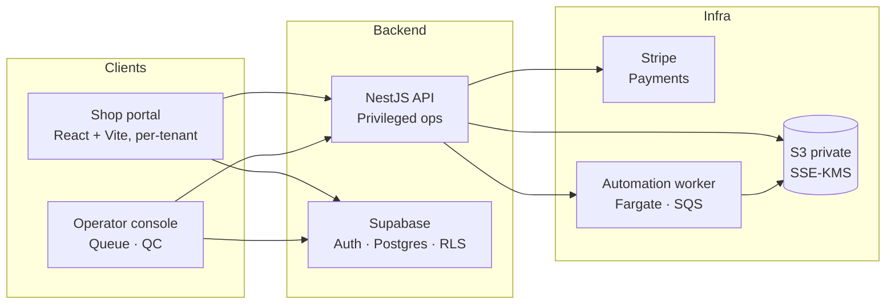
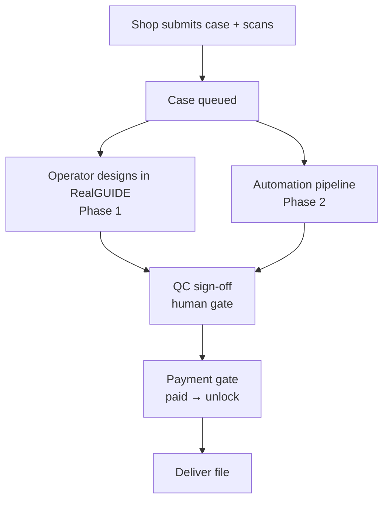
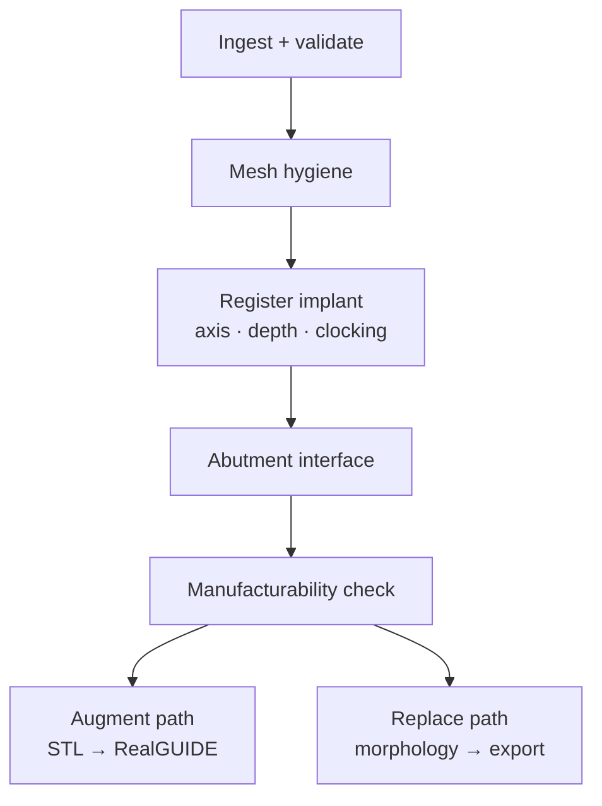

# Software Design Document — Implant CAD Portal & Automation

> ## 📜 HISTORICAL RECORD — not the operational truth
>
> This document predates the operator product app (`apps/product` + `apps/bff`) and the
> client's five-stage flow. It is kept **unedited** as a record of what was designed and
> why; do not treat any command, path, count or flow description in it as current.
>
> For what is true today:
> - **[`../CLAUDE.md`](../CLAUDE.md)** — the repo map: the five gates, the freeze line, the
>   stage model, and the traps.
> - **[`ARCHITECTURE.md`](ARCHITECTURE.md)** — how the system fits together as built.
> - **[`engagement/product-app-plan.md`](engagement/product-app-plan.md)** — the product
>   plan, and §10 for the record of client direction as it arrived.
> - **[`engagement/product-runbook.md`](engagement/product-runbook.md)** — how to run and
>   demo the product app.
> **Specifically superseded:** "Approved design — decisions committed" refers to the
> ORIGINAL portal/automation split. The product app's own decisions, grill and
> amendments live in `engagement/product-app-plan.md`.

**Status:** Approved design — decisions committed. Items requiring client input are isolated in §10 (Open Questions).
**Audience:** the engineering team building this, and the stakeholder funding it.

---

## 1. Introduction

The client operates a digital dental design business: dental shops send intraoral scans of patients with implants, and the client produces the implant CAD restoration files (crowns and bridges) using RealGUIDE. The client already holds the customer relationships, the RealGUIDE license, and the clinical and regulatory responsibility.

This project delivers the software that productionizes that operation in two products: a **portal** that takes shops from submission through payment and delivery, and an **automation pipeline** that reduces the per-case manual effort. The two are built and delivered independently.

A single technical fact constrains the entire design and is stated here because much of what follows derives from it: **RealGUIDE is closed software — macros and a GUI, with no API or SDK.** It cannot be driven programmatically at scale. The automation therefore **augments** RealGUIDE (preparing inputs the operator imports) or **replaces** specific steps with open tooling; it never attempts to script RealGUIDE. Any approach depending on programmatic control of RealGUIDE was ruled out at the outset.

---

## 2. Goals

**Portal (Phase 1).**
- Replace ad-hoc intake (email/file transfer) with a structured, multi-tenant submission flow that captures the exact implant specification the operator needs.
- Move 20–100 MB scan files from a clinic to cloud storage reliably, including over poor connections.
- Give the operator a single queue to fulfill, gate quality behind a human QC step, and deliver only after payment.
- Let the client add new dental-shop customers without adding administrative headcount.

**Automation (Phase 2).**
- Remove the mechanical, non-clinical labor from each case — file preparation, mesh cleanup, implant-position recovery, manufacturability checking — and hand the operator a prepared case, cutting per-case time.
- Establish, through a contained spike, whether implant registration can be automated to clinical tolerance, before committing to the larger build.

**Non-goals.** Demand generation, customer acquisition, clinical design judgment, and FDA/quality-system responsibility remain the client's. The software supports compliance (audit trail, QC gate) but does not own it. Full lights-out automation is explicitly *not* a goal: every automated result passes a human QC gate.

---

## 3. Purpose & scope

The purpose is to turn a manual, relationship-driven service into a scalable software-mediated one, and then to compress its unit cost through automation — without taking on the client's clinical or regulatory liability, and without depending on a tool we cannot control.

In scope: the portal, the automation pipeline, and the infrastructure to run them. Out of scope: anything in §2 Non-goals. Patient identity is out of scope by design — cases carry an opaque shop-supplied label only (see §9 on data handling).

---

## 4. System architecture

Shop and operator clients are tenant-scoped React (Vite) applications. Supabase provides authentication, the Postgres database, and row-level isolation; shop clients read and write tenant-scoped data against it directly. The NestJS API performs only privileged operations — signing storage URLs, enqueuing jobs, handling Stripe webhooks, and serving the operator's cross-tenant access under a service role. Scan files live in a private S3 bucket. The automation pipeline (Phase 2) runs as a decoupled worker behind an SQS queue. *(A case-lifecycle flowchart and the automation-pipeline flowchart appear in §6 and §7.)*

---

## 5. Phase 1 — Portal design

### 5.1 Frontend & repository
The portal is a **React single-page application built with Vite**. Server-side rendering was unnecessary — the portal sits entirely behind authentication, so SEO is irrelevant — and a dedicated API already exists, so Next.js would add weight without benefit.

The codebase is a **monorepo** (pnpm/Turborepo) containing the web app, the NestJS API, the automation worker, and a `shared` package of TypeScript types and zod validation schemas. The case and implant data shapes are used by all three surfaces; sharing them prevents drift.

### 5.2 Authentication
Authentication is **email and password plus magic link**, with email verification required. **Password reset is handled via magic link** rather than a separate reset flow. SSO/SAML is intentionally excluded — the customers are small labs, not enterprises.

The NestJS API establishes trust by **verifying the Supabase JWT against the Supabase JWKS endpoint** in middleware: the signature and claims (audience, expiry, role, tenant) are checked locally against the cached signing keys, with no per-request network call to Supabase. Requests failing verification are rejected at the trust boundary.

### 5.3 Tenancy & authorization
The authorization model is **split**: row-level security isolates shop tenants, and the operator's elevated access is mediated by the backend.

- **Shop clients** read and write only their own data, enforced by Supabase **row-level security**. A shop can never see another shop's cases.
- **The operator** is never granted a client-side cross-tenant RLS bypass. The operator console performs its cross-tenant reads and writes **through the NestJS API using the Supabase service role**, with the API enforcing operator authorization and writing an audit record for every cross-tenant access.

A blanket operator RLS policy was rejected: it would place a powerful, all-tenant grant on the client, where a single misconfiguration or a stolen session would expose every shop. To keep RLS efficient, `tenant_id` is **denormalized onto every child table** so policies are indexed equality checks rather than per-row subqueries against the parent case.

### 5.4 Data model & migrations
The schema (cases, implant sites, restorations, case files, processing jobs, orders, profiles) is the previously delivered model, extended with the `role` field and the denormalized `tenant_id`. It is PII-free: a case is identified by an opaque shop-supplied label, never patient data.

- `implant_sites` — one row per implant, capturing the RealGUIDE inputs: tooth number, implant system, implant code, scan-body type.
- `restorations` — single crowns and bridges with their tooth spans.
- `case_files` — uploaded scans as private S3 objects.

Schema and **row-level-security policies are managed as raw SQL migrations** (Supabase CLI) as the single source of truth, because RLS, policies, and triggers are expressed poorly by ORMs. TypeScript types are generated from the database for the application layer.

### 5.5 Upload subsystem
Scan files reach 100 MB and originate on clinic networks, so the upload path is the portal's most demanding component.

Uploads go **directly from the browser to S3 using presigned multipart uploads.** Proxying uploads through the API was impossible — API Gateway/Lambda caps payloads at 6 MB — and single-PUT presigned uploads were rejected because they cannot resume after a dropped connection.

The backend signs `CreateMultipartUpload`, a presigned URL per `UploadPart` (5 MB parts), and `CompleteMultipartUpload`. The client uploads parts in parallel with per-part retry and backoff. **Upload state — the `uploadId` and completed part ETags — is persisted server-side** in an `uploads` table, so an interrupted upload resumes after a page reload by reconciling against the S3 part list. The client computes a **SHA-256 checksum while chunking**, stored on the file record and verified on completion, guarding against silent corruption of clinical geometry.

Because the backend never sees the file bytes, **validation runs as an S3-event-triggered worker**: on object creation, it downloads the file and runs a cheap check (valid STL/PLY header, vertex/face counts in range, basic manifold sanity) before the case may be queued. Failures are flagged back to the shop.

### 5.6 Storage
Scan files are stored in a private S3 bucket encrypted with **SSE-KMS** — the per-key control, rotation, and audit trail are appropriate for biometric-adjacent geometry, and the marginal cost is small. Objects use the key layout `tenant/{tenant_id}/case/{case_id}/{kind}/{uuid}.stl`, which carries no PII and enables per-tenant lifecycle rules and prefix-scoped IAM. A **lifecycle policy** transitions delivered cases' inputs to infrequent-access/Glacier after a grace period and deletes them after a retention window (the retention duration is a legal/clinical decision — §10).

### 5.7 Case lifecycle & concurrency
The case lifecycle is an explicit state machine — `draft → submitted → queued → assigned → in_design → qc_pending → ready → paid → delivered`, plus `rejected` and `failed` — with legal transitions enforced in one place and illegal jumps rejected. This keeps status from drifting away from reality.

Concurrency uses **claim-based assignment**: a technician claims a case, which sets `assigned_to` and locks it for others; a heartbeat with a timeout auto-releases an abandoned claim. This prevents two technicians from designing the same case, which is the real failure mode in a shared queue.

### 5.8 Operator console & the fulfillment seam
The operator works the queue in the console, but fulfillment itself happens in RealGUIDE, **out of band** — the portal has no visibility into the design work and status is operator-asserted, which the design accepts and documents. To minimize context-switching, each case exposes a one-click **work packet** (all inputs plus the case specification sheet) and an explicit **QC sign-off** action that is the only transition into `ready`.

### 5.9 Payment & preview
A delivered design file cannot be retracted, so the shop must judge quality before paying. The approval artifact is a **server-rendered, watermarked turntable/image set** of the deliverable mesh (headless Blender render) — it conveys quality while exposing no usable geometry; an in-browser low-poly viewer was rejected because it would still ship millable geometry.

Billing at MVP is **per-case prepay via Stripe Checkout Session** (the least code), with the `orders` model structured so **monthly account billing** can be added later without schema change (the final billing model is a client decision — §10). The `paid` transition is driven only by a **signature-verified, idempotent webhook** (processed event IDs are stored, since Stripe retries), never by the client. Refunds and disputes are explicit states with a defined policy for already-delivered files.

### 5.10 Delivery & notifications
Downloads are served as **short-TTL signed URLs** issued only after `orders.paid` is confirmed, with each issuance logged; the bucket stays private, so a leaked URL key is inert. **Email notifications** (Resend/Postmark) fire on the events case-received, ready-for-approval, delivered, and needs-attention, through a thin pluggable notifications service (SMS can be added later).

---

## 6. Case lifecycle

---

## 7. Phase 2 — Automation design

Phase 2 is delivered in three sub-phases of increasing risk, each independently gated (§9).

### 7.1 Orchestration & compute
The portal enqueues jobs on **Amazon SQS** (with a dead-letter queue); the pipeline runs as a **containerized worker on AWS Fargate (Linux)**, which right-sizes CPU and memory for CAD work without Lambda's 15-minute and memory ceilings. The mesh toolchain is pinned and containerized: **trimesh** and **Open3D** for geometry and registration, **PyMeshLab** for cleaning, **Blender (headless)** for booleans and the preview renders. The worker authenticates to S3 and Supabase via an IAM/service role with prefix-scoped, least-privilege access; secrets live in a secrets manager. Failed jobs dead-letter and **fall back to manual** so a case is never stuck.

### 7.2 Ingest, hygiene, and validation
The worker pulls the case files, re-validates them (parity with the upload check), and normalizes units and orientation. Mesh hygiene **auto-repairs up to a defined quality threshold** (fill holes, remove non-manifold geometry, isolate the relevant shell, light smoothing) and **rejects to manual beyond it**, rather than risk corrupting clinical geometry by over-repairing. Cleaning uses a parameterized, logged PyMeshLab filter chain.

### 7.3 Scan-body localization
Registration needs a rough starting pose for each scan body. The form supplies *which tooth* and *which scan-body type* (so the target geometry is known) but not the 6-DOF pose. The localization strategy is **staged**: the MVP is **operator-seeded** — the operator clicks each scan body once to seed its position, which is reliable and immediate; the automated path uses **feature-based global registration** (FPFH descriptors with RANSAC/Fast Global Registration in Open3D) to locate the known scan-body geometry without a click; and every case is instrumented to accumulate labeled data so an **ML detector** can replace this later once data justifies it. The timing of that progression is a deliberate decision, not an open one.

### 7.4 Registration & clocking
Fine alignment recovers the implant **axis, depth, and rotational clocking**. A global-registration result seeds **point-to-plane ICP**, which converges well on surfaces. Because scan bodies are near-rotationally-symmetric, ICP can lock onto the wrong clocking, which would ruin the screw channel; clocking is therefore validated by **multi-start ICP** (taking the lowest-residual candidate and checking the margin to the runner-up) **combined with explicit detection of the anti-rotation feature**. Each case carries a confidence score; results below the acceptance threshold are **flagged to manual**, never shipped blind. (The numeric tolerance and ground-truth reference are set with the client before the spike — §10.)

### 7.5 Abutment interface, manufacturability, and output
The abutment interface is generated **parametrically from the known implant connection geometry**; the emergence profile, which carries clinical judgment, is **left to RealGUIDE in the augment path**. Manufacturability checks (minimum wall thickness via ray-cast/SDF, cement gap, undercuts relative to the insertion axis, milling-tool feasibility) produce a per-case report; failures flag rather than auto-edit.

Output for the augment path must convey the recovered implant pose into RealGUIDE, which cannot be done programmatically. The pipeline therefore **bakes the pose into the exported geometry** — pre-positioning and orienting the meshes in the frame RealGUIDE's import honors — **and provides a sidecar specification sheet** (positions, axes, codes) for what import will not carry. This seam is validated against a real RealGUIDE import early, as a known integration risk.

### 7.6 Replace path (2C, conditional)
For simple, high-volume case types, a full open-tool pipeline can produce a design without RealGUIDE. Segmentation and registration are **owned in-house using open tooling** (3D Slicer/DentalSegmentator for CBCT where relevant, Teeth3DS-trained segmentation for intraoral, Open3D for registration). Crown **morphology — the clinical step open tools don't provide free — is produced by integrating an open proposal model (e.g. CrownGen-style) and finalizing the margin line and interface in a CAD engine**; a fully self-trained morphology model is treated as a later, narrow, data-funded bet, not an opening move. Rented engines (3Shape Automate, Dentbird, UP3D) are noted but do not cover implant abutments. The final selection for 2C is conditional on reaching it (§10). Every automated output passes the human QC gate.

---

## 8. Infrastructure created

Provisioned as code (Terraform/CDK):

- **Supabase project** — Auth (GoTrue), Postgres with RLS policies, generated types. Pro tier.
- **AWS S3** — one private bucket, SSE-KMS, versioning, lifecycle rules, prefix-scoped bucket policy; plus a separate bucket for rendered previews.
- **AWS KMS** — a customer-managed key for scan/preview encryption, with rotation.
- **AWS SQS** — a jobs queue and a dead-letter queue.
- **AWS Fargate** — an always-on service for the NestJS API and an on-demand task definition for the automation worker (Linux container image with the pinned mesh toolchain); ECR for images.
- **AWS IAM** — least-privilege roles for the API and worker (prefix-scoped S3, KMS, SQS, Secrets Manager).
- **AWS Secrets Manager** — Stripe keys, Supabase service-role key, third-party API keys.
- **Stripe** — account, products/prices, and a verified webhook endpoint.
- **Sentry** — error tracking for web, API, and worker.
- **Email provider** (Resend/Postmark) — transactional domain and templates.
- **Hosting/CDN** — the Vite SPA on a CDN (Vercel/CloudFront + S3); custom domain and TLS.
- **CI/CD** — GitHub Actions: typecheck, tests (including RLS-policy and state-machine tests), database migrations, and staged deploys.

---

## 9. Cost

### 9.1 Ongoing / operating cost (monthly)
Estimates in USD on AWS, **excluding** the RealGUIDE license, operator labor, and Stripe processing fees (which are a pass-through cost of sales, ~2.9% + $0.30 per transaction). Volume assumption: ~300 cases/month, ~200 MB per case.

| Item | Low / early | ~300 cases/mo |
|---|---|---|
| Supabase Pro | $25 | $25 |
| S3 storage (with lifecycle) | $2 | $5–10 |
| S3 requests + egress | $2 | $6–10 |
| KMS (key + requests) | $1 | $2 |
| SQS | <$1 | <$1 |
| Fargate — API (always-on, small) | $15 | $15–25 |
| Fargate — worker (on-demand during jobs) | $1 | $3–15 |
| Frontend hosting / CDN | $0–10 | $10 |
| Sentry | $0 (dev) | $0–26 |
| Email (transactional) | $0–10 | $10 |
| Domain / misc | $5 | $5 |
| **Total (infra/ops)** | **~$60–90** | **~$100–150** |

Operating cost scales sub-linearly; the lifecycle policy (§5.6) is the main lever as storage grows. If sub-phase **2C** is built with self-hosted ML inference, add GPU compute — kept variable by running inference on-demand/Batch rather than an always-on GPU instance.

### 9.2 One-time build cost & timeline

| Deliverable | Effort | Price |
|---|---|---|
| Portal MVP (§5) | 6–10 wks (250–400 hrs) | $30k–$55k fixed |
| 2A Registration spike (§7.3–7.4) | 2–4 wks (80–160 hrs) | $10k–$20k fixed |
| 2B Augment pipeline (§7.1–7.5) | 3–5 months | $50k–$120k milestone |
| 2C Replace + ML (§7.6) | 6+ months | $120k–$250k+ T&M |

Rate basis ~$100–150/hr (solo senior, direct); retainer ~$15k–25k/mo. The portal and spike are fixed-price; the augment pipeline and 2C are milestone- or time-and-materials and gated on results (§below).

### 9.3 Milestones & gates
1. **M1 Portal MVP** *(fixed)* — gate: a real case is submitted, fulfilled, paid, and delivered.
2. **M2 Registration spike** *(fixed)* — gate: clocking/position within the agreed tolerance on sample scans → go/no-go on automation.
3. **M3 Augment pipeline** *(milestone)* — gate: measured per-case time reduction on live cases → go/no-go on scaling.
4. **M4 Replace/ML** *(T&M, conditional)* — only if volume, case mix, and M2/M3 justify.

---

## 10. Open questions (require client input)

These are deliberately unresolved here because they depend on the client's operation or judgment, not on engineering:

1. **Monthly case volume** and number of dental-shop customers — drives operating cost and automation ROI.
2. **Caseload composition** — proportion of simple crowns versus full-arch/All-on-X; the latter is the least automatable and would weaken Phase 2 ROI.
3. **Average manual RealGUIDE time per case**, and the most time-consuming steps.
4. **S3 retention duration** — the legal/clinical record-retention requirement that sets the lifecycle window.
5. **Billing model** — per-case prepay versus monthly account billing (the schema supports both).
6. **Registration acceptance tolerance and ground-truth source** — needed before the M2 spike to define "passed."
7. **Dominant implant systems / scan-body types** — sets the build order for library support.
8. **Output formats** shops require (STL for milling, vendor-specific, printed-model).
9. **Shop geography** — determines tax and multi-currency handling.
10. **Intake style** — shop self-serve versus operator-gated submission.
11. **2C morphology source** — rent versus open-model-plus-CAD versus self-train (conditional, only if 2C is reached).

---

## Appendix — Glossary

- **Implant** — titanium fixture in the jaw replacing a tooth root. **Abutment** — connector between implant and crown.
- **Scan body** — precision marker screwed onto the implant so an intraoral scan captures the implant's exact position and orientation; its library STL is known per type.
- **Clocking / indexing** — the rotational orientation of the implant connection; critical for screw-retained crowns, as small errors misplace the screw access channel.
- **Emergence profile** — the contour where the restoration emerges through the gum; partly a clinical judgment.
- **Margin line** — boundary where the crown meets the prepared tooth/abutment. **Antagonist / occlusion** — the opposing arch and how teeth meet.
- **STL / PLY** — 3D mesh formats (geometry only; carry no implant transform).
- **ICP** — Iterative Closest Point; refines an existing rough alignment by minimizing surface distance. **FPFH / RANSAC global registration** — feature-based method that finds an initial alignment from scratch to seed ICP.
- **FDI vs Universal numbering** — two tooth-numbering systems; the notation is stored to avoid ambiguity.

---

*This document records the committed design. Companion diagrams (interactive architecture, lifecycle, and pipeline) are available in the project thread.*
