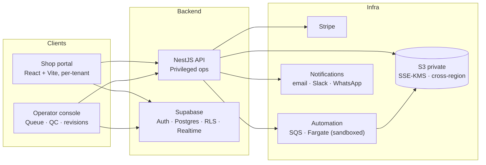
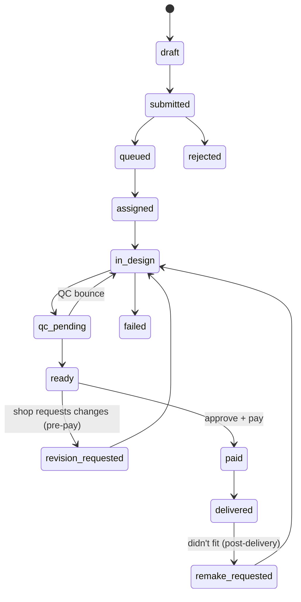
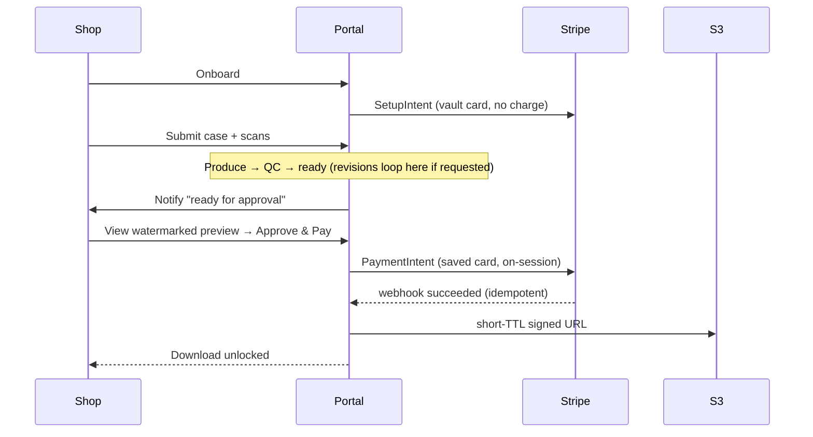
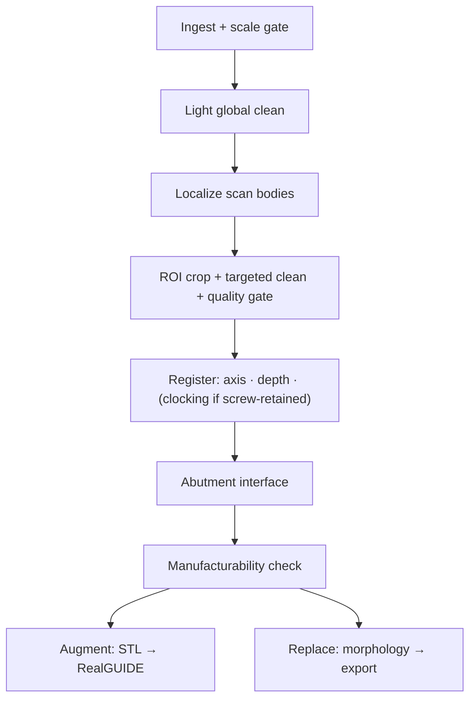

# Software Design Document — Implant CAD Portal & Automation

**Status:** Approved design — single source of truth. Decisions are committed; items needing client input are isolated in §9. This revision adds the revision/remake workflow, a richer case specification, security and abuse controls, the automation quality-feedback loop, multi-channel notifications (email, Slack, WhatsApp), and AI-assisted pricing. It supersedes all earlier drafts.

---

## 1. Introduction

The client operates a digital dental design business: dental shops submit intraoral scans of patients with implants, and the client produces the implant CAD restoration files (crowns and bridges) in RealGUIDE. The client owns the customer relationships, the RealGUIDE license, and the clinical and regulatory responsibility.

This project delivers the software that productionizes that operation as two independently-deliverable products: a **portal** carrying shops from submission through revision, payment, and delivery, and an **automation pipeline** that reduces per-case manual effort.

One technical fact constrains the whole design: **RealGUIDE is closed — macros and a GUI, no API.** It cannot be driven programmatically at scale. The automation therefore **augments** RealGUIDE (preparing inputs the operator imports) or **replaces** specific steps with open tooling; it never scripts RealGUIDE.

---

## 2. Goals

**Portal.** Replace ad-hoc intake with a structured, multi-tenant submission flow capturing the full clinical specification; move 20–100 MB scan files from a clinic to cloud storage reliably; give the operator one queue to fulfill behind a human QC gate; **support the iterative reality of dental design — revisions before delivery and remakes after**; deliver only after payment; let the client add shops without adding admin headcount.

**Automation.** Remove the mechanical, non-clinical labor per case (file prep, mesh cleanup, implant-position recovery, manufacturability checks) and hand the operator a prepared case — lowering cost per case and lifting throughput per operator without added headcount; route the easier case types (notably cement-retained) through a fuller automated path; and establish, through a contained spike, whether implant registration can be automated to clinical tolerance before committing to the full build.

**Non-goals.** Demand generation, clinical judgment, and FDA/quality-system responsibility remain the client's. **Full lights-out automation is not a goal** — every automated result passes a human QC gate, and the operator stays in the loop (seeding, QC, revisions) even in Phase 2.

---

## 3. Purpose & scope

Turn a manual, relationship-driven service into a scalable software-mediated one, then compress its unit cost through automation — without assuming the client's clinical/regulatory liability and without depending on a tool we cannot control. **Patient** identity is out of scope by design: a case carries an opaque shop-supplied label, never patient PII. (Shop-*user* account data — names and emails for login and notifications — necessarily exists; "PII-free" refers to the patient, not the shop's staff.)

**Engagement terms (outside this design, required in the contract):** IP ownership of the code and pipeline, a liability cap that keeps clinical-outcome liability with the client (mirroring the responsibility split above), and a data-processing agreement covering the scan data.

---

## 4. System architecture



Shop and operator clients are tenant-scoped React (Vite) apps. Supabase provides auth, Postgres, row-level isolation, and Realtime. The NestJS API performs only privileged operations — signing storage URLs, enqueuing jobs, handling Stripe webhooks, serving the operator's cross-tenant access under a service role, and dispatching notifications. Scan files live in a private, cross-region-replicated S3 bucket. The automation pipeline runs as a decoupled, sandboxed worker behind SQS.

---

## 5. Phase 1 — Portal design

### 5.1 Frontend & repository
A **React SPA built with Vite** (no SSR — fully authenticated, SEO irrelevant, dedicated API exists). The codebase is a **pnpm/Turborepo monorepo** with the web app, NestJS API, automation worker, and a `shared` package of TypeScript types and zod schemas reused across all three to prevent drift.

### 5.2 Authentication
**Invite-only onboarding, not open signup** — this is a B2B service over existing relationships, so an admin invites a vetted shop (invite token → set password + MFA); open self-signup is the wrong model and an abuse/spam vector. Auth is **email/password plus magic link**, email verification required, with **password reset via magic link**. There are three roles: **shop_user** (a member of a tenant clinic), **technician** (claims and fulfils the queue), and **admin** (pricing, shops, users, SLA). **Technician and admin accounts require MFA (TOTP via Supabase MFA)** — see §5.13, since these roles have cross-tenant reach. SSO/SAML is excluded (customers are small labs). The API trusts a request by **verifying the Supabase JWT against the JWKS** in middleware — signature and claims checked locally against cached signing keys, no per-request call to Supabase.

### 5.3 Tenancy & authorization
A **split** model over **organizations, not individuals**: a dental shop is a `tenant` (clinic) with one or more member users, so several staff at a clinic share its cases (and a multi-location group can span tenants). Shop-users read/write only their own tenant's data, enforced by Supabase **row-level security** keyed on membership — a shop can never see another shop's cases. The operator side (**technician**, **admin**) is **never** granted a client-side cross-tenant RLS bypass; the operator console performs cross-tenant reads/writes **through the NestJS API using the service role**, with the API enforcing the role and auditing every access. A blanket operator RLS policy was rejected — it would place an all-tenant grant on the client where one misconfiguration leaks every shop. To keep RLS efficient, **`tenant_id` is denormalized onto every child table** so policies are indexed equality checks. The operator roles are the largest blast radius in the system, which is why §5.13 mandates MFA and audit on them.

### 5.4 Data model & migrations
Schema and RLS policies are managed as **raw SQL migrations** (Supabase CLI) as the single source of truth; TypeScript types are generated from the database. The model carries **no patient PII** — only shop-user account data (names/emails for login and notifications).

Core: `tenants` (clinic orgs), `memberships` (user↔tenant with role), `profiles`, `cases`, `implant_sites` (per-implant: tooth, system, code, scan-body type), `restorations`, `case_files`, `processing_jobs`, `deliverables`, `orders`, `uploads` (multipart resume state).

Organizations & roles — a shop is an org with member users, and the operator side splits into admin/technician:
```sql
create table tenants (                      -- a dental-shop clinic (or location)
  id uuid primary key default gen_random_uuid(),
  name text not null, status text not null default 'active',  -- active | suspended
  billing_mode text not null default 'prepay',                -- prepay | account
  created_at timestamptz not null default now()
);
create table memberships (                  -- a user's role within a tenant
  user_id uuid not null,
  tenant_id uuid references tenants(id),    -- null for operator-side roles
  role text not null,                       -- 'shop_user' | 'technician' | 'admin'
  primary key (user_id, tenant_id)
);
```

The **case specification is richer than a one-shot model** — real cases carry clinical detail, and one attribute (retention) governs how automatable the case is:
```sql
alter table restorations
  add column retention      text,   -- 'screw' | 'cement'  (drives clocking requirement, §6.4)
  add column shade          text,   -- e.g. A2
  add column material       text,   -- e.g. zirconia
  add column pontic_design  text,   -- bridges only
  add column occlusal_notes text,
  add column instructions   text;
```

Iterative workflow + traceability tables:
```sql
-- versioned deliverables with a design record for defect tracing
create table deliverables (
  id                uuid primary key default gen_random_uuid(),
  case_id           uuid not null references cases(id) on delete cascade,
  tenant_id         uuid not null,
  version           int  not null,
  storage_key       text not null,
  preview_key       text,                 -- watermarked render
  pipeline_version  text,                 -- which automation build produced it
  library_versions  jsonb,                -- scan-body/implant library versions used
  confidence        jsonb,                -- per-implant registration/clocking confidence
  qc_by             uuid,                 -- operator who signed off
  created_at        timestamptz not null default now(),
  unique (case_id, version)
);
-- per-case communication (clarifications, change requests)
create table messages (
  id          uuid primary key default gen_random_uuid(),
  case_id     uuid not null references cases(id) on delete cascade,
  tenant_id   uuid not null,
  author_role text not null,              -- 'shop' | 'operator'
  author_id   uuid,
  body        text not null,
  created_at  timestamptz not null default now()
);
```

Notification/event tables:
```sql
create table events (
  id uuid primary key default gen_random_uuid(),
  tenant_id uuid, case_id uuid references cases(id) on delete cascade,
  type text not null, payload jsonb not null default '{}',
  created_at timestamptz not null default now()
);
create table outbox (
  id uuid primary key default gen_random_uuid(),
  event_id uuid not null references events(id),
  channel text not null,                  -- 'email'|'slack'|'whatsapp'|'webhook'|'sms'
  recipient text not null, status text not null default 'pending',
  attempts int not null default 0, dedup_key text unique,
  created_at timestamptz not null default now(), sent_at timestamptz
);
create table notification_prefs (
  tenant_id uuid not null, event_type text not null,
  channels text[] not null default '{email}', primary key (tenant_id, event_type)
);
-- configurable pricing rules read by the price engine (§5.10)
create table pricing_rules (
  id uuid primary key default gen_random_uuid(),
  tenant_id uuid,                         -- null = default; set = per-shop override
  rule_type text not null,                -- 'base' | 'per_unit' | 'per_implant' | 'modifier'
  key text,                               -- e.g. material / retention / rush, for modifiers
  amount_cents int not null,
  active bool not null default true
);
```
All child tables carry the denormalized `tenant_id`. Each `order` references the **`deliverables` version it pays for**, so a chargeable remake is a *separate* order against a new version (a case can carry multiple orders) — the one-order-per-case assumption is dropped. `orders` stores the **itemized price breakdown** the rule engine produced (§5.10) alongside the total, for receipts and dispute evidence.

### 5.5 Portal pages

**Shared / auth:** sign in; magic-link callback; **accept invite** (invite-only — no open signup); email verification; **onboarding wizard** (clinic profile + add payment method, §5.10).

**Shop (tenant):**
| Page | Purpose |
|---|---|
| Case list / dashboard | All of the shop's cases; status chips, filters, "New case" |
| New-case wizard | Step 1 details → 2 implant sites → 3 restorations (incl. retention/shade/material) → 4 upload → 5 review/submit |
| Case detail | Status timeline, files, **message thread**, and the **approval + preview panel** when `ready`, with **Approve & Pay** and **Request changes** actions |
| Billing | Monthly invoices, saved cards, receipts |
| Account settings | Clinic, users, notification preferences (channel per event) |

**Operator — `technician` (T) and `admin` (A):**
| Page | Role | Purpose |
|---|---|---|
| Global queue | T | Every case across shops; **SLA time-to-breach** + aging, claim-to-work, filters, revision/remake flags |
| Case detail (operator) | T | Inputs, work-packet download, message thread, status controls, deliverable upload (versioned), **QC sign-off** (only path to `ready`), revision handling |
| Pricing | A | Per case-type and/or per-shop pricing; revision/remake policy; **SLA targets per case-type** |
| Shops | A | Invite/suspend tenants, billing terms, **per-shop approval-rate** |
| Users | A | Manage technician/admin accounts and roles |
| Revenue / orders | A | Paid/unpaid, refunds, disputes |
| Automation monitor *(Phase 2)* | T/A | Queue depth, failures, **live clear-rate and false-confidence-rate per scan-body-type**, manual-fallback cases |
| Library | A | Implant-system/scan-body library config (versioned) |

### 5.6 Upload subsystem
**Accepted inputs are pinned:** intraoral-scan meshes (`.stl` / `.ply`), with a maximum file size and per-case file count enforced both client- and server-side; **CBCT/DICOM is out of scope for the MVP** (intraoral-mesh only — see §9), and if added later is a separate input path with its own tooling. Uploads go **directly browser→S3 via presigned multipart**. Proxying through the API was impossible (API Gateway caps payloads at 6 MB); single-PUT presigned uploads were rejected (no resume on a dropped connection). The backend signs `CreateMultipartUpload`, a URL per `UploadPart` (5 MB parts), and `CompleteMultipartUpload`; the client uploads parts in parallel with retry. **Upload state is persisted** in `uploads`, so an interrupted upload resumes after reload. The client computes a **SHA-256** while chunking, verified on completion. For shops in distant geographies, **S3 Transfer Acceleration** is enabled to avoid slow cross-ocean uploads of large files. Because the backend never sees the bytes, **validation runs as a sandboxed S3-event worker** (§5.13) before a case may be queued; failures flag back to the shop.

### 5.7 Storage
Private S3 bucket, **SSE-KMS** (per-key control/rotation/audit, appropriate for biometric-adjacent geometry). Key layout `tenant/{tenant_id}/case/{case_id}/{kind}/{uuid}.stl` — no PII, enables per-tenant lifecycle and prefix-scoped IAM. Buckets are **versioned and cross-region-replicated** — the scan files are irreplaceable, so DR treats them as primary assets (§5.13).

**Lifecycle is keyed off delivery, not submission**, and never deletes a paid-but-undownloaded deliverable. Inputs transition to infrequent-access/Glacier a grace period after `delivered`, and are deleted only after a retention window that begins at delivery — so a shop paying or downloading late (a real case) never finds the file gone. The deliverable itself is retained while any order against it is unsettled or undownloaded. (Retention duration is a client decision, §9.)

**Offboarding & deletion-on-request.** A suspended or departing shop's data is retained per the retention policy by default; a **deletion-on-request** path purges a tenant's scans and deliverables (including the S3 versions) on request — relevant because the scan is biometric-adjacent. Deletion is an admin action, logged, and respects any legal-hold or retention obligation (a client decision, §9).

### 5.8 Case lifecycle, revisions & concurrency
The lifecycle is an explicit state machine. Crucially, **dental design is iterative**, so it is not one-shot:



Legal transitions are enforced in one place; illegal jumps rejected. Each design cycle produces a **new `deliverables` version**, so history is preserved and a remake can be traced to which version failed. Concurrency uses **claim-based assignment**: a technician claims a case (`assigned_to` set, locked for others); a heartbeat with timeout auto-releases an abandoned claim, preventing two technicians designing the same case.

**Phase 1 builds the manual subset of this machine.** The states with no producer until Phase 2 — `awaiting_seed` and any stage-1/stage-2 automation split — are *not* built in M1; a Phase 1 case runs `submitted → queued → assigned → in_design` (manual RealGUIDE) `→ qc_pending → ready`, with the revision and remake loops. **SLA:** each case-type carries a turnaround target; the operator queue shows **time-to-breach**, the shop sees an **estimated delivery**, and an approaching or missed target raises an alert (§5.12). A **chargeable remake opens a new order against a new deliverable version** (§5.4, §5.10), keeping each charge distinct.

### 5.9 Operator console & the fulfillment seam
The console serves two operator roles: **technicians** work the queue (claim, fulfil, QC sign-off, revisions), while **admins** manage pricing, shops, users, and SLA targets (§5.5). Fulfillment happens in RealGUIDE **out of band** — the portal has no visibility into the design work and status is operator-asserted, which the design accepts. Each case exposes a one-click **work packet** (all inputs + the case spec sheet), the **message thread** for clarifications, and an explicit **QC sign-off** that is the only transition into `ready`. Revision and remake requests reopen the case to `in_design` with the shop's reason and message attached, and the operator uploads a new deliverable version.

### 5.10 Payment, preview & free-work controls

**Price determination.** A case's price is computed from the **structured specification the shop enters** — the `implant_sites` and `restorations` rows — **not from the number of files uploaded** (file count is noise: every case uploads several scans regardless of implant count). The billable quantity is explicit and validated, not inferred: the system charges for two implants because the shop *declared* two implant sites. Price is **itemized, not a flat per-job fee**: `base case fee + Σ per-unit (each crown and bridge pontic) + Σ per-implant fee + modifiers (material, screw vs cement, rush)`. The billable **unit is usually per tooth/unit** (a 3-unit bridge over 2 implants is 3 units), so `restorations` drive most of the price and `implant_sites` the per-implant component — the *rules* are fixed, the *case total* varies. A **configurable rule engine** reads `pricing_rules` (operator-set per-unit/per-implant/tiered rates with per-shop overrides) and **auto-quotes at submission**, shown to the shop. **The submission quote is locked**: an operator override that *raises* the price requires the shop's **re-consent before work proceeds** — never a surprise at the pay screen — while a downward adjustment needs no re-consent. A **consistency check** at submission rejects mismatches — e.g. a bridge spanning teeth not declared as implant sites — to prevent under-declaration; the itemized breakdown is stored on `orders` for the receipt and disputes. *(Phase 2 adds a downstream audit: once the automation localizes the scan bodies, it flags when the geometry's implant count or positions disagree with the declaration — anti-error/anti-under-billing, not the pricing basis.)*

**The flow is produce → preview → pay**: work is triggered at submission, the deliverable is produced, and the shop pays *after* previewing it. **"Paid" is the closing event, not the kickoff.** Securing the instrument and capturing the charge are **separated**, and the model is guarded against free-work abuse:

- **Onboarding** — the shop adds a card via Stripe **SetupIntent** (vaulted, no charge); a shop cannot submit without a card on file.
- **Approval panel (status `ready`)** — the shop sees a **server-rendered, watermarked, clinically-informative preview** (headless Blender): occlusal and proximal-contact views and a margin cross-section, not just a turntable — so the shop can judge fit and approve *confidently* (a weak preview drives rejections and disputes), while exposing **no usable geometry**. Then **Approve & Pay** (a **PaymentIntent on the saved card, on-session**, 3-D Secure inline — **this is where money is collected for prepay shops**) or **Request changes** (→ `revision_requested`). A decline blocks download and prompts a card update; the deliverable stays locked.
- **Monthly invoice (Billing page)** — established high-volume shops on **account billing** have approval add a line item, settled monthly via Stripe Invoicing.

**Free-work guardrail (new).** Because the operator does full work before any charge, the design bounds the exposure: **new shops (no track record) start on prepay or a deposit**, graduating to produce-then-pay after a clean history; **per-shop approval rate is tracked**, and a shop with repeated abandonment or low approval is moved back to prepay/pay-to-process. (A global pay-to-process alternative is logged in §9.)

**Revision/remake billing policy.** Revisions requested before payment are part of the original fee; post-delivery remakes follow a defined policy (e.g., free within N days if the fault is the design's, charged if the prescription changed) — the terms are a client decision (§9), but the workflow and versioning support either. A chargeable remake is billed as a **separate order against the new deliverable version** (§5.4), keeping each charge distinct and traceable.

The `paid` transition is driven only by the **signature-verified, idempotent webhook**, never by the client. Refunds/disputes are explicit `orders` states; the watermarked preview evidences what was approved.



### 5.11 Delivery
Downloads are served as **short-TTL signed URLs** issued only after `orders.paid`, each logged; the bucket stays private, so a leaked URL key is inert. Each download serves the current `deliverables` version.

### 5.12 Notifications & channels (email, Slack, WhatsApp)
Notifications are driven by **domain events emitted on state-machine transitions**, written to a **transactional outbox in the same DB transaction as the state change** — so an outage never loses an event. A dispatcher retries pending rows with **dedup by event ID**. Channels go through an abstraction honoring per-tenant `notification_prefs`. They split by audience:

- **Email** — universal fallback for both sides (Resend/Postmark).
- **Slack → the operator's team.** Operators live in Slack, so the actionable alerts belong there. A plain **incoming webhook** (one-way) or a **Slack app with Block Kit** where the *needs-seeding* message carries a button that deep-links or claims the case — turning the notification into the entry point of the work queue. Cost is **$0 incremental** (the client's workspace; API/webhooks are free on any plan).
- **WhatsApp Business → the shop.** Good for shop-facing transactional messages, especially in WhatsApp-heavy markets. These are **utility-category template messages** (Meta pre-approval required), billed per delivered message: roughly **$0.004 in the US up to ~$0.045 in expensive markets**, with **service-window replies free**. Integration is **Cloud API direct** (Meta-hosted, free, you build it) or a **BSP (Twilio/360dialog)** (faster onboarding, 50%–4x markup). At ~300 cases/month this is **~$5–40/month**. (Note: since Jan 2026 Meta bans general-purpose AI chatbots on WhatsApp — irrelevant for transactional templates.)
- **Webhook** — for shops that want events pushed into their own system.

Event → default channel/recipient:

| Event | → Tenant (shop) | → Operator |
|---|---|---|
| Entered automation | email/WhatsApp "received" | queue counter |
| **Needs seeding** | — | **Slack, actionable + escalating** |
| Automation failed / low-confidence | — | **Slack, actionable** → manual fallback |
| Ready for approval | email/WhatsApp "preview & approve" | dashboard |
| Revision requested | — | **Slack** (reopens case) |
| **Paid** | email/WhatsApp receipt | **Slack digest** (silent increment) |
| Payment failed | email/WhatsApp "update card" | Slack only if recurring |
| Remake / refund / dispute | confirmation | **Slack alert** |

Two consequences are built in. **"Paid" is nearly a non-event for the operator** — work precedes payment, the download auto-unlocks, so the operator gets a silent increment and a Slack digest, with loud alerts reserved for the exceptions (payment-failed, refund, dispute, remake). **The turnaround-gating alert is "needs seeding"** — when a case hits `awaiting_seed` a human blocks a waiting shop, so that Slack alert is actionable and **escalates** if unactioned past an SLA window. The operator console also subscribes via **Supabase Realtime** for live in-app updates; the outbox handles the out-of-app channels.

### 5.13 Security & abuse controls
- **Operator/admin MFA (mandatory).** The operator's cross-tenant reach makes account compromise the worst-case breach; MFA (TOTP) is required, not optional.
- **Untrusted-mesh sandbox.** Validation, preview-render, and the automation worker process **uploaded files that are untrusted** — mesh parsers have had memory-safety CVEs. These run in a **network-isolated container** (no outbound except S3/queue), least-privilege IAM, with **CPU/memory/time limits** to defeat complexity and decompression bombs. A malicious upload cannot pivot or exfiltrate.
- **Rate limiting & quotas** on submission and upload to bound abuse and cost.
- **Secrets** in a manager (Stripe, Supabase service-role, WhatsApp/Slack tokens), never in env files; rotated.
- **Disaster recovery (specified):** Supabase automated backups + point-in-time recovery; S3 versioning + cross-region replication for the irreplaceable scan/deliverable buckets; a target **RPO of minutes** (PITR) and a documented, tested **RTO**; the recovery procedure is runbooked, not assumed.

---

## 6. Phase 2 — Automation design

Delivered in three sub-phases of increasing risk, each independently gated (§8).



### 6.1 Orchestration & compute
The pipeline is a **workflow with a human step** (operator seeding, §6.3), so a single queued task cannot run it. At MVP the pipeline is **split at the human boundary** off the case state machine: **stage 1 (auto)** ingest → light clean → localization-prep → `awaiting_seed`; *operator seeds*; **stage 2 (auto)** registration → interface → manufacturability → packaging → `ready`. Each stage is its own SQS message + Fargate task. Once localization becomes automatic (§6.3), the longer automated chain moves to **AWS Step Functions** (per-step retry/catch, checkpointing, `waitForTaskToken`), with SQS as the ingress buffer.

Compute: containerized **Fargate (Linux)** workers, **sandboxed per §5.13** (untrusted geometry), sized 4–8 GB for dense-mesh memory; **GPU on ECS-EC2 or AWS Batch** for 2C inference (Fargate has no GPU). Every stage is **idempotent**, keyed `case_id:stage:attempt`, writing **deterministic S3 keys**; visibility timeout extended by heartbeat; failures dead-letter and **fall back to manual**.

### 6.2 Ingest & hygiene
STL is unitless, so **scale is gated, not assumed**: the arch bounding box is checked against a plausible human range (~45–70 mm); implausible scale flags rather than guesses, and scanner metadata is trusted where present. Hygiene is **targeted, not global** — a hole in a distant molar is irrelevant while a 1 mm defect on the scan body is fatal — so the order is **light global clean → localize → crop a region of interest around each scan body → high-quality targeted repair with a per-ROI quality gate**. Because intraoral scans are routinely **non-watertight**, hole-filling / mesh-healing is part of that targeted repair (MeshLib fill-holes or PyMeshLab), applied **within the ROI** so a true scan-body defect is repaired without inventing geometry elsewhere. Rejection is **per-implant** where possible, not whole-case.

### 6.3 Scan-body localization
The automated path uses the **position prior to crop the candidate region first**, then **FPFH / Fast Global Registration within that crop** against the known scan-body STL — collapsing the small-object-in-large-scene false-match problem. The reliable default is **operator-seeding**: one click seeds translation and the implant axis is estimated from the ROI (two-click fallback when axis confidence is low). The **seeder is configurable per shop** (operator-seed default; shop-seed opt-in for high-volume shops). Every operator-seeded, registration-confirmed case emits a labeled example that feeds a later ML detector (§6.7), explicitly a 2C-era step.

### 6.4 Registration & clocking — and retention-aware routing
Fine alignment recovers implant **axis, depth, and (for screw-retained) rotational clocking**. Global registration and coarse ICP run on **voxel-downsampled** clouds (≈0.1–0.2 mm), then **trimmed point-to-plane ICP refines at full resolution within the scan-body ROI**. Because the scan-body ROI only *partially* overlaps the library model (and, later, a design only partially overlaps the prep), the ICP **overlap / "final-overlap" parameter is set explicitly** rather than assuming full correspondence — a common cause of bad dental registrations. CloudCompare's point-pair-picking + ICP (which runs directly on meshes) is the GUI equivalent of this operator-seed → ICP flow, and its **C2M / M3C2 deviation** is both the registration **cross-check** and the **2A spike's accuracy yardstick** against ground truth.

**Retention type routes the difficulty.** Clocking is the irreducibly-hard part — the rotational index is broken only by the scan body's small anti-rotation feature, which intraoral scanners often capture poorly. But **clocking only matters for screw-retained restorations**, which need an accurate screw access channel. **Cement-retained restorations need no screw channel, so clocking is not gating for them** — they take the easier path (position + axis only). The pipeline therefore reads `retention` from the case spec and applies the hard clocking gates only to screw-retained cases; **cement-retained single crowns are the most automatable wedge and the first auto-target.**

For screw-retained cases, clocking confidence is the **RMSE gap between best and next-best rotation** (multi-start ICP) **combined with explicit anti-rotation-feature alignment**. **Hard confidence gates** on position, axis, and clocking route an implant to **manual** below threshold; the screw channel is never auto-placed on ambiguous clocking. Only **scan-body types empirically shown reliable are on the auto-clock allow-list** (driven by live stats, §6.7). A **multi-implant consistency check** adds a further signal.

**Ground-truth extraction is the spike's first deliverable, not an assumption:** because RealGUIDE is closed, the 2A spike must establish how to export the positioned implant/abutment geometry and derive its transform. **Plan B is a named deliverable, not a footnote:** if export proves infeasible, ground truth comes from a **physical phantom with known implant positions** (machined and measured) plus an operator-co-validated subset of real cases — defined up front so the spike cannot stall on this single unknown.

### 6.5 Abutment interface, manufacturability, output
Constructing the restoration is **constructive-solid-geometry (boolean) work**, now named explicitly in the spec: the **screw access channel** is a boolean *subtraction* of a channel solid along the recovered implant axis (screw-retained only); the **abutment interface** is generated parametrically from the known implant connection geometry and *unioned* to the restoration base; and the **cement gap** is a controlled **mesh offset of the prep/abutment surface followed by a boolean difference**. The emergence profile (clinical) is still **left to RealGUIDE in the augment path**.

These booleans run on **scan-derived meshes that are often non-watertight and degenerate**, where naive mesh booleans produce cracks, slivers, and non-manifold edges — so the spec calls for a **robust boolean engine**, with **SDF-based (signed-distance-field) CSG** as the robust technique: rasterize each operand to a distance field, combine in that representation, and re-extract the surface, which is intrinsically tolerant of holes and degeneracies. The **primary production candidate is MeshLib** (C++ with Python bindings): it provides boolean, precision offsetting, mesh healing/fill-holes, smoothing, ICP, and mesh↔SDF in one fast, **dental-proven** SDK (its own benchmarks show a ~0.17 s dental boolean where some libraries fail), already used by multiple digital-dentistry vendors — so it could **consolidate much of the geometry stack** (boolean + offset + healing + ICP + SDF) into a single dependency. Its adoption is **gated on licensing** (§9): MeshLib is **source-available but not permissively licensed** — free only for non-commercial/educational use, so commercial production needs a **paid annual licence** (Startup or Commercial tier). The terms are favourable for a per-case business — a **fixed annual fee with no royalties and no per-unit/per-user charge**, so it does not tax per-case margin — but the price is quote-based (positioned below one engineer's salary; the Startup tier, for early-stage/<$100k-ARR companies, likely applies to the client and is cheaper). The non-commercial licence is usable to **evaluate it free during the 2A spike** before committing. Where the licence doesn't fit, the **open fallback** is Open3D + PyMeshLab plus a self-built SDF-CSG step (the underlying smooth-boolean math is public, from Íñigo Quílez's distance-function articles).

**Manufacturability and QC deviation checks** (minimum wall thickness, cement gap, undercuts, milling-tool feasibility, design-vs-prep deviation maps) produce a per-case report; failures flag, never auto-edit. An **SDF distance field yields wall-thickness and undercut directly**; the **CloudCompare CLI** remains for M3C2 / cloud-to-mesh deviation where it is best-in-class (MeshLib's mesh↔SDF and collision tools can serve the same role if licensed). These tools *analyse, align, and combine* geometry; they do not *generate* crown morphology (the §6.6 engine), so they raise robustness and lower cost without raising the automation ceiling. The augment-path output conveys the recovered pose into RealGUIDE — which cannot be done programmatically — by **baking the pose into the exported geometry plus a sidecar specification sheet**, validated against a real RealGUIDE import early.

### 6.6 Replace path (2C, conditional)
For simple, high-volume case types (cement-retained single crowns first), a full open-tool pipeline can produce a design without RealGUIDE. Segmentation and registration are **owned in-house with open tooling** (3D Slicer/DentalSegmentator for CBCT where relevant, Teeth3DS-trained segmentation for intraoral, Open3D for registration). Crown morphology is produced by **integrating an open proposal model (CrownGen-style) and finalizing the margin line and interface in a CAD engine using smooth SDF booleans** (the public Íñigo Quílez smooth-min/-union formulation) for organic margin and emergence blends that tolerate imperfect scan geometry where mesh booleans crack; a self-trained model is a later, narrow, data-funded bet. Rented engines (3Shape Automate, Dentbird, UP3D) **do not cover implant abutments**. The final 2C source is conditional (§9). Every automated output passes the human QC gate.

### 6.7 Automation quality-feedback loop & traceability
Automation without a feedback loop silently rots; this one is closed by design.
- **QC corrections are captured as signal.** When the operator corrects or rejects an automated result, the **delta between the automated output and the corrected/approved output is stored** as a labeled training example — the data flywheel is operational, not aspirational.
- **Live quality metrics.** **Clear-rate** (fraction auto-passing the gates) and **false-confidence-rate** (auto-passed but QC-corrected) are tracked **per scan-body-type and per case-type** on the automation-monitor page.
- **The auto-clock allow-list is driven by these live stats** — a scan-body-type stays auto-clocked only while its false-confidence-rate remains near zero; it drops off automatically if quality regresses. Not a static list.
- **Deliverable traceability.** Every deliverable is stamped (in `deliverables`) with the **pipeline version, library versions, per-implant confidence scores, and the QC sign-off identity** — an immutable design record so any defect (or remake) is traceable to the exact pipeline and inputs that produced it.
- **The automate-or-flag decision is threshold-based, not ML — by design.** Each conditional step routes to a human on deterministic confidence metrics (ICP RMSE, the clocking best-vs-next-best gap, the anti-rotation-feature residual, inlier ratio, multi-implant consistency, per-ROI mesh-quality counts), with thresholds calibrated against ground truth in 2A. A deterministic gate is *preferred* over a learned one here: it is explainable and auditable for a clinical-safety decision, needs no upfront training data, and is intrinsic to the registration work — **not a separate cost**. ML belongs in *performing* hard steps (the localization detector and morphology engine, 2C), not in gating. An **optional ML "automate-or-flag" classifier** — combining these features to predict QC-pass and raise the auto-clear rate beyond hand-tuned thresholds — is a *later, billable add-on* (§8.3), commissioned only if the live metrics above show the thresholds over-flag or admit false-confidence. It **supplements the hard safety gate, never replaces it**, and trains on the labeled deltas captured here.

### 6.8 What is and is not automatable

Stated explicitly, per pipeline step. ✅ = no human per case once built · 🟡 = automated when confidence is high, human otherwise · 🔴 = human (or a generative engine that itself needs human QC), always.

| Step | Status | Condition / what triggers the human |
|---|---|---|
| Ingest, format & scale validation | ✅ | — |
| Mesh hygiene | 🟡 | auto within quality thresholds; below → human cleans or rejects |
| Scan-body localization | 🟡 | auto (FPFH) on clean scans; otherwise operator one-click seed |
| Registration — position + axis | ✅* | *for well-captured scans; low confidence → human |
| Clocking (screw-retained only) | 🟡 | auto only for allow-listed scan-body types + adequate capture; else human. **N/A for cement-retained** |
| Screw-channel placement | ✅* | *once clocking is known (screw-retained) |
| Abutment interface | 🟡 | parametric where the library covers it; emergence may need human |
| Manufacturability / QC deviation | ✅ | CloudCompare M3C2 / Open3D |
| Output packaging / RealGUIDE export | ✅ | — |
| **Crown / bridge morphology** | 🔴 | clinical shape — human in the augment path, or a generative engine **with human QC** in 2C |
| **Clinical QC sign-off** | 🔴 | every case, mandatory |
| Revisions / remakes | 🔴 | judgment |
| Low-quality / partial-scan triage | 🔴 | judgment |

**The clearest single fact:** a **cement-retained simple crown** is the most automatable case type — it skips clocking entirely, so its geometry path is fully ✅ (morphology aside), making it the highest-margin, near-marginal-cost segment and the natural first auto-target. A **screw-retained, poorly-scanned, ambiguous-clocking** case is the least — it can be 🔴 end-to-end. Morphology and QC are never automated away.

**Human-in-the-loop touchpoints** (in pipeline order):

| Touchpoint | Who | When | Shrinks as automation matures? |
|---|---|---|---|
| Scan-body seeding | Operator | per implant (MVP) | **Yes** — FPFH then ML reduces it |
| Low-confidence override | Operator | per flagged implant | **Yes** — the allow-list grows |
| Mesh-quality rejection | Operator | per failing scan | Partially |
| Crown morphology | Operator (in RealGUIDE) | every case (augment path) | Only via a 2C engine — still QC'd |
| QC sign-off | Operator | every case | **No — permanent** |
| Revision handling | Operator | on shop request | No |
| Remake handling | Operator | post-delivery | No |
| Failure fallback | Operator | per dead-lettered job | Shrinks as reliability improves |
| Preview approval | **Shop** | every case | No — it is the shop's decision by design |
| Clarifications | Shop ↔ Operator | as needed | No |

The 2A spike's success metric follows directly: **"what fraction of the client's real caseload clears the confidence gates, with a near-zero false-confidence rate,"** broken down by retention type and scan-body type — that clear-rate, measured on real cases, determines whether 2B pays back and is the number to put in front of the client before quoting Phase 2.

### 6.9 Pros, cons & alternatives

**Pros of building (augment-first).** Cuts the mechanical operator time per case → lower marginal cost and more throughput at scale; the cement-retained route unlocks an easy, high-volume wedge early; it builds a labeled-data flywheel that widens the automatable share — and lowers cost per case — the longer it runs, opening optional productization to other labs later; augmenting keeps RealGUIDE (the operator's proven tool) in the loop, so it is far less brittle than replacing it; and sub-phase gating contains risk and spend.

**Cons / risks.** Up-front R&D cost whose ROI only turns positive above ~a few hundred cases/month; registration/clocking is genuine R&D with irreducible uncertainty, so it may clear only part of the caseload; ground-truth extraction from a closed RealGUIDE is an unsolved dependency; it does **not** remove the human (seeding, morphology, QC, revisions), so it is labor *reduction*, not elimination, and ROI is bounded accordingly; and a multi-tool pipeline plus the RealGUIDE seam carries ongoing maintenance/breakage risk on upstream changes.

**Alternatives.**

| Alternative | Pros | Cons | When it's right |
|---|---|---|---|
| **A. Portal only (stay manual)** | no automation capex or R&D risk; the portal still delivers scaling + admin value | marginal cost stays at operator labor; no throughput gain | low volume, or a full-arch-heavy (least-automatable) caseload |
| **B. Rent automation** (3Shape Automate / Dentbird / UP3D) | fast, proven, ~$2/unit, no build or maintenance | **no implant-abutment support** (the client's core); per-unit fee forever; no moat; data goes to a third party | only for a non-implant *crown* portion, if the client does that work |
| **C. Augment-only (cap at 2B)** | captures most of the time savings at lower cost/risk; keeps RealGUIDE | morphology stays manual (a ceiling) | **the recommended target** unless volume justifies 2C |
| **D. Full custom ML (2C, self-train)** | potential moat; niche full-automation | $90k–180k+, data-hungry, design-software regulatory exposure, competes with million-case incumbents | only with the flywheel + proven high volume |
| **E. Hybrid: own registration + rent morphology** | own the hard implant-specific geometry, rent the commodity crown shape | rented morphology is weak on implant abutments; another integration seam | a 2C middle path |

**Recommendation.** Default to **C (augment-only)** once the **2A spike** gates it; fall back to **A (portal only)** if §9 reveals low volume or a full-arch-heavy caseload; treat **D/E** as conditional, data-funded, post-2B bets. **B** applies only if the client also handles non-implant crowns.

---

## 7. Infrastructure created

Provisioned as code (Terraform/CDK):
- **Supabase** — Auth (with MFA), Postgres + RLS, Realtime, automated backups + PITR, generated types (Pro tier).
- **AWS S3** — private scan bucket (SSE-KMS, versioning, **cross-region replication**, **Transfer Acceleration**, lifecycle keyed off delivery) + previews bucket.
- **AWS KMS** — customer-managed key with rotation.
- **AWS SQS** — jobs queue + dead-letter queue. **AWS Step Functions** when the pipeline is fully automated.
- **AWS Fargate + ECR** — always-on NestJS API task; on-demand **sandboxed** worker task; **ECS-EC2 / Batch (GPU)** for 2C.
- **AWS IAM + Secrets Manager** — least-privilege roles; Stripe/Supabase/Slack/WhatsApp tokens.
- **Stripe** — account, products/prices, verified webhook, SetupIntent + Invoicing.
- **Slack app / incoming webhook** — operator notifications.
- **WhatsApp** — Cloud API (or BSP) with approved utility templates.
- **Email provider** (Resend/Postmark).
- **Sentry** — error tracking (web, API, worker).
- **Hosting/CDN** — Vite SPA; custom domain + TLS.
- **CI/CD** — GitHub Actions: typecheck, tests (incl. RLS-policy and state-machine tests), migrations, staged deploys.

---

## 8. Cost & opportunity

### 8.1 Operating cost (monthly)
USD on AWS, **excluding** the RealGUIDE license, operator labor, and Stripe fees (pass-through, ~2.9% + $0.30/txn). Assumption: ~300 cases/month, ~200 MB/case.

| Item | Low / early | ~300 cases/mo |
|---|---|---|
| Supabase Pro (incl. PITR) | $25 | $25 |
| S3 storage (lifecycle) | $2 | $5–10 |
| S3 requests + egress + Transfer Acceleration | $3 | $8–14 |
| S3 cross-region replication | $1 | $3–8 |
| KMS | $1 | $2 |
| SQS / Step Functions | <$1 | $1–3 |
| Fargate — API (always-on, small) | $15 | $15–25 |
| Fargate — worker (on-demand, sandboxed) | $1 | $3–15 |
| Slack notifications | $0 | $0 |
| WhatsApp (utility templates) | $0–5 | $5–40 |
| Frontend hosting / CDN | $0–10 | $10 |
| Sentry | $0 (dev) | $0–26 |
| Email | $0–10 | $10 |
| Domain / misc | $5 | $5 |
| **Total (infra/ops)** | **~$70–110** | **~$120–200** |

Cost scales sub-linearly; the lifecycle policy and WhatsApp geography are the main levers. 2C self-hosted ML adds variable GPU compute (on-demand/Batch, not always-on). **If MeshLib is licensed (§6.5/§9), its annual fee is a separate fixed OPEX line — quote-based, no per-case component — and is excluded from the infra figures above.**

### 8.2 One-time build cost (AI-assisted) & milestones
These reflect an **AI-assisted senior build**. The compression is uneven by design: AI is a force multiplier on code *production* (the portal — standard SaaS), not on the automation's real bottlenecks (verifying 3D-registration correctness on messy scans, the closed-RealGUIDE seam, clinical-safety judgment). **The cost center therefore shifts toward the automation R&D, and "AI-cheap" applies to the portal, not the hard automation** — under-pricing the R&D on that assumption is the trap.

| Deliverable | AI-assisted | vs traditional | Gate |
|---|---|---|---|
| Portal MVP (§5) | **$18k–32k / 3–6 wks** | $30k–55k | Real case submitted → fulfilled → paid → delivered |
| 2A registration spike (§6.3–6.4) | **$8k–15k / 1.5–3 wks** | $10k–20k | Clear-rate + near-zero false-confidence (by retention/scan-body type) → go/no-go |
| 2B augment pipeline (§6.1–6.7) | **$35k–80k / 1.5–3 mo** | $50k–120k | Measured per-case time reduction on live cases → go/no-go |
| 2C replace + ML (§6.6) | **$90k–180k+ / 3–5 mo** | $120k–250k+ | Conditional on volume, case mix, M2/M3 |

Rate basis ~$100–150/hr (solo senior, direct); retainer ~$15k–25k/mo. The portal and spike are fixed-price; the rest is milestone/T&M and gated. AI tooling (Claude Code/Cursor, ~$20–200/mo) is a rounding error. In a moderate-volume operation the margin and throughput gains typically recover the build within roughly a year, and the staged gating means spend follows proven results rather than projections.

### 8.3 Cost per feature, with rationale (AI-assisted)

**How to read these prices.** Cost tracks **complexity and risk**, and here complexity is dominated by *correctness on messy real data* and *integration with a closed tool* — not lines of code. That is precisely why AI compresses the portal (code-bound, standard patterns) far more than the automation (verification-bound, novel, safety-critical). Each line below states what drives its number. Total effort: portal MVP ~22–36 days; ranges widen with depth of error handling, test coverage, and clinical-spec breadth.

**Phase 1 — Portal (MVP-essential):**

| Feature | Cost | Why it costs this / complexity driver |
|---|---|---|
| Setup, monorepo, IaC, CI/CD | $1.5k–2.5k | Full cloud IaC (S3/KMS/SQS/Fargate/IAM) + a green pipeline; config-heavy, not code-heavy |
| Auth (email/pw + magic link + MFA + JWKS) | $1.5k–2.5k | Happy path is quick; cost is MFA enrollment, JWKS verification, and magic-link reset edge cases |
| Tenancy & RLS authz | $2k–3k | Security-critical core — a bug is a data breach; cost is *proving* isolation + the policy test suite, not LOC |
| Data model & migrations | $0.8k–1.5k | Mechanical; migration + tenant-id denormalization discipline |
| New-case wizard | $2k–3k | Dynamic per-implant rows + conditional restoration spec + validation; UX edge cases need iteration |
| **Upload subsystem** | $2.5k–4k | Hardest portal feature — multipart + resume reconciliation + integrity + sandboxed validation; distributed-reliability work that fails in clinics if naive |
| Storage (S3/KMS/lifecycle) | $0.5k–1k | Config-heavy, cheap |
| State machine + revision/remake + locking | $1.5k–2.5k | Cost is correctness of transitions + race-free claim-locking, not volume |
| **Operator console** | $2.5k–4k | Breadth of operator workflows across several screens + claim-lock UX + versioned deliverables |
| **Payment + preview + webhooks + guardrail** | $2.5k–4k | Payment correctness (idempotency, 3DS, disputes) + the headless-Blender preview render (often underestimated) + guardrail logic |
| Delivery (signed URLs) | $0.3k–0.6k | Trivial |
| Notifications (outbox + email + Slack) | $1k–1.8k | Cost is the reliable-delivery outbox + dedup, more than the channels |
| Security (sandbox, rate-limit, secrets) | $0.8k–1.5k | Cost is the sandbox isolation for untrusted meshes + rate-limiting |
| Observability + testing + docs | $1.5k–2.5k | Cross-cutting; test coverage including RLS + state-machine tests |
| **MVP-essential subtotal** | **~$21k–34k** | Cost centers in bold; barebones cut ≈ $18k, full ≈ $30–34k |

*Deferrable:* WhatsApp channel + templates +$1.5k–3k · account/monthly billing +$1k–2k · per-case messaging threads +$0.8k–1.5k · Transfer Acceleration + cross-region +$0.5k–1k.

**Phase 2 — Automation:**

| Feature | Cost | Why it costs this / complexity driver |
|---|---|---|
| 2A — ground-truth extraction from RealGUIDE | $2k–4k | Reverse-engineering a transform out of a closed tool with no API — pure discovery; can balloon |
| 2A — localization + registration + clocking prototype | $3k–6k | Algorithmic correctness + tuning on real scans; AI writes the Open3D calls, humans verify the geometry/numerics |
| 2A — toolchain container + accuracy report + go/no-go | $2k–5k | Eval harness + accuracy metrics + the analysis to make a defensible decision |
| **2A spike total** | **$8k–15k** | The de-risk gate before any 2B commitment |
| 2B — orchestration (SQS/Step Functions, retries, fallback) | $4k–9k | Distributed reliability (retries, idempotency, fallback) + the human-boundary split + sandbox |
| 2B — ingest + scale gating + validation | $2k–4k | Robust scale gating + validation across different scanners |
| 2B — mesh hygiene (targeted, ROI, quality gates) | $3k–7k | Must work on noisy real IOS scans; robustness across scan quality drives the range |
| 2B — localization (operator-seed UI + FPFH) | $4k–8k | Seeding UX + making FPFH reliable on a small object in a large scene |
| **2B — registration & clocking** | $6k–14k | **Biggest line** — clinical-safety-critical correctness on messy data + irreducible clocking uncertainty; the spike outcome sets the effort, hence the wide range. **Where the engagement can fail** |
| 2B — abutment interface generation | $3k–7k | Parametric per implant library; each additional implant system adds work |
| 2B — manufacturability + QC deviation (CloudCompare M3C2) | $2k–5k | Lower — CloudCompare does the heavy measurement lifting |
| 2B — output packaging + RealGUIDE import seam | $3k–6k | Trial-and-error against a closed tool's import behavior |
| 2B — automation feedback loop (telemetry, QC capture, allow-list) | $3k–6k | Telemetry + the QC-correction capture data pipeline + metrics |
| 2B — portal integration + QC tooling | $2k–5k | Wiring the pipeline to the portal + the operator QC viewer |
| **2B — testing on real clinical data + iteration** | $3k–8k | Open-ended validation on the client's real cases; AI can't shortcut it; range reflects how messy real data is |
| **2B total** | **~$35k–79k** | Cost weight sits in registration/clocking + real-data iteration |

The Phase 2 cost centers — **registration/clocking and real-data iteration** — are exactly the verification-bound parts AI does not compress, which is why the project's cost weight sits in the automation R&D, not the portal, and why those two lines carry the widest ranges and the most risk.

**Optional AI add-on — automate-or-flag classifier.** The base scope gates automation with deterministic thresholds (§6.7), which are intrinsic and *not* separately billed. A learned classifier that raises the auto-clear rate beyond those thresholds is a distinct, optional line item:

| Add-on | Cost | Gate / justification |
|---|---|---|
| ML automate-or-flag classifier (tabular features → predict QC-pass) | $10k–20k | **Commission only post-2B**, once hundreds-plus labeled cases exist and live metrics show thresholds over-flag or admit false-confidence. Pays back by converting human-touched cases into automated ones. Supplements — never replaces — the hard safety gate. Low end = tabular; higher if it must inspect geometry. Minor ongoing retraining/drift cost. |

### 8.4 Opportunity & forecast — what completing each phase unlocks

The cost above is one side of the business case; this is the other. Figures are an illustrative model on a representative **~200 implant units/month at ~$50/unit** baseline — substitute the client's real numbers (§9); the *multipliers* (margin, capacity, growth) hold regardless of the absolute baseline. Estimates, not guarantees. The loud, client-facing version with the trajectory chart is the separate opportunity-forecast brief.

**Completing Phase 1 (the portal) removes the admin ceiling.** Structured self-serve intake, more shops served without adding admin headcount, faster and more reliable turnaround, and a professional front end that is itself a sales asset. It does not cut design labor, so margin holds (~66%); the gain is operational leverage and the freedom to grow volume — this is the conservative path.

**Completing Phase 2 (automation) removes the labor ceiling.** The mechanical per-case work is automated, so cost per case falls (gross margin ~66% → ~82%) and one operator handles roughly twice the cases — growth stops being capped by hours. Cement-retained crowns approach near-marginal cost, the data flywheel widens the automatable share over time, faster turnaround becomes a premium tier, the portal plus WhatsApp extend reach to new markets without a local presence, and the platform itself becomes optionally productizable to other labs — these are the base and optimistic paths.

**Two-year scenarios** (monthly run-rate from the illustrative ~200 units/month start):

| Scenario | What drives it | Year-2 revenue (run-rate) | Year-2 gross profit | vs today |
|---|---|---|---|---|
| Today | manual baseline | ~$120k | ~$79k | — |
| **Conservative** — Phase 1 only | portal leverage, ~15%/yr growth | ~$159k | ~$105k | **1.3×** |
| **Base** — Phase 1 + 2 | margin 82% + ~35%/yr | ~$219k | ~$180k | **2.3×** |
| **Optimistic** — Phase 1 + 2 + growth | + cement-retained wedge, rush tier, ~60%/yr | ~$306k | ~$254k | **3.2×** |

The gap between conservative and the others is almost entirely the margin jump and the capacity to take on more shops — both delivered by Phase 2, not Phase 1.

**Payback.** In the base case the incremental gross profit (~$100k/year above today by year 2) recovers the full Phase 1 + Phase 2 build (~$65–130k) within about a year; Phase 1 plus the 2A spike (~$30–50k) pays back in a matter of months on admin savings and capacity alone. Staged gating means spend follows proven results rather than projections.

**Assumptions (kept honest).** The baseline is illustrative — plug in real volume and the multiples carry over. The margin and capacity gains assume the caseload skews toward automatable types (simple and cement-retained crowns); a full-arch-heavy caseload gains less. Volume growth depends on the client's sales and shop relationships — the software *enables* it, it doesn't guarantee it. Automation earns back its cost only above a moderate monthly volume; below that, the portal alone is the win and automation waits.

---

## 9. Open questions (require client input)

1. **Monthly case volume** and number of dental-shop customers.
2. **Caseload composition** — simple crowns vs full-arch/All-on-X, and **screw- vs cement-retained share** (cement-retained is the easier automation wedge; share drives Phase 2 ROI).
3. **Average manual RealGUIDE time per case**, and the heaviest steps.
4. **Expected approval/conversion rate** and abandonment behavior (sizes the free-work exposure and the new-shop deposit policy).
5. **Revision & remake policy terms** — what is in-scope vs chargeable, and remake window.
6. **S3 retention duration** (window begins at delivery).
7. **Billing model & billable unit** — per-case prepay vs monthly account billing; new-shop deposit/prepay threshold; and the **billable unit** (per-unit/per-tooth, per-implant, or tiered case-types) plus the rate card and modifiers the pricing engine applies.
8. **Payment-vs-processing order** — produce-then-pay (committed) vs global pay-to-process.
9. **Registration acceptance tolerances and ground-truth source** — needed before M2.
10. **Dominant implant systems / scan-body types** — sets build order and the auto-clock allow-list.
11. **Output formats** shops require.
12. **Shop geography** — tax/multi-currency, WhatsApp markets, Transfer Acceleration need.
13. **2C morphology source** — rent vs open-plus-CAD vs self-train (conditional).
14. **CBCT/DICOM scope** — MVP assumes intraoral-scan meshes only; confirm whether CBCT-based implant planning is in scope (a separate input path) now, later, or never.
15. **SLA targets** — the turnaround target per case-type that the operator queue and shop-facing estimated-delivery are measured against.
16. **Geometry-engine licensing** — whether to license **MeshLib** or build on the **open Open3D/PyMeshLab + self-built SDF-CSG** fallback (§6.5). Verified: MeshLib is non-commercial-free but **commercial use needs a paid annual licence** — a *fixed* annual fee with **no royalties or per-unit charge** (so it doesn't scale with case volume), quote-based and positioned below one engineer's salary; the **Startup tier** (<3 yrs old, <$100k ARR) likely applies to the client. It can be **evaluated free during the 2A spike**. The annual fee is an OPEX line not yet in §8.1; obtain the quote before committing.

---

## 10. Engineering implementation notes

Concrete guidance for the build team. Patterns and library choices are recommendations; pin exact versions at project start.

### 10.1 Repository & stack
Monorepo (pnpm + Turborepo):
```
apps/web      React 18 + Vite + TS  (shop + operator SPAs)
apps/api      NestJS 10             (privileged ops only)
apps/worker   Python 3.11           (automation pipeline; Phase 2)
packages/shared  TS types + zod schemas (used by web, api, worker codegen)
db/           SQL migrations + RLS policies (source of truth)
infra/        Terraform or CDK
```
Key deps — **web:** `@supabase/supabase-js`, `@stripe/stripe-js`, TanStack Query, `react-hook-form`, `zod`. **api:** NestJS, `@aws-sdk/client-s3` + `@aws-sdk/s3-request-presigner`, `stripe`, `jose` (JWKS verify), `zod`. **worker:** `boto3`, `open3d`, `trimesh`, `pymeshlab`, `numpy`, and a **boolean/geometry engine — MeshLib (primary candidate: boolean + offset + healing + ICP + mesh↔SDF in one SDK, licence-gated, §9) or a self-built SDF-CSG step over Open3D/PyMeshLab (open fallback)**; Blender (headless) and the CloudCompare CLI baked into one container image (ECR).

### 10.2 API surface (NestJS — privileged operations only)
Everything else (case/implant reads and writes, queue reads) goes **directly to Supabase under RLS** — the API is reserved for what RLS can't or shouldn't do:
```
POST /uploads/init            → CreateMultipartUpload; returns {uploadId, key}
POST /uploads/:id/part-url    → presigned UploadPart URL for {partNumber}
POST /uploads/:id/complete    → CompleteMultipartUpload + checksum verify
POST /cases/:id/submit        → enqueue stage-1 job
POST /cases/:id/approve       → create on-session PaymentIntent on saved card
POST /webhooks/stripe         → verify signature, idempotent, flip orders.paid
GET  /cases/:id/download      → short-TTL signed GET (gated on orders.paid)
# operator (service-role, role-checked, audited):
GET  /operator/queue · POST /operator/cases/:id/{claim,qc-signoff,deliverable,price-override}
```

### 10.3 Tenant isolation (RLS)
Put `tenant_id` in the JWT as a custom claim (Supabase auth hook / `app_metadata`). Tenant-scoped policy pattern:
```sql
create policy tenant_read on cases for select
  using (tenant_id = (auth.jwt() ->> 'tenant_id')::uuid);
```
The operator never gets a cross-tenant client policy: the API uses the **service-role key** (bypasses RLS), checks `role = 'operator'` itself, and writes an audit row per cross-tenant access. Gate RLS in CI with policy tests (pgTAP, or a harness issuing queries under different JWTs and asserting cross-tenant denial).

### 10.4 Resumable multipart upload (the hardest portal feature)
Browser → S3 directly (the API only signs):
1. Chunk the file into 5–10 MB parts; stream-hash SHA-256 as you go.
2. Per part: request a presigned `UploadPart` URL, `PUT` it, store `{partNumber, ETag}` back to the `uploads` row. Run 3–5 parts concurrently with retry + exponential backoff.
3. **Resume on reload:** read the `uploads` row, reconcile against S3 `ListParts`, upload only missing parts, then `CompleteMultipartUpload`; verify the checksum.
4. **Validate after complete** in the S3-event worker (header, vertex/face counts, manifold sanity) — never trust the client. Use `@aws-sdk/s3-request-presigner` for per-part URLs; presigning is mandatory because the upload is client-side.

### 10.5 State machine & claim-locking
Record allowed transitions in one map; a service-layer guard rejects illegal jumps and writes the `events`/outbox row **in the same transaction** as the state change. Claim-lock via `assigned_to` + `lock_expires_at`: claim is a conditional update (`where assigned_to is null or lock_expires_at < now()`), a heartbeat extends it, and a periodic sweeper releases expired locks.

### 10.6 Payments (Stripe)
Onboarding: `SetupIntent` (or Checkout in setup mode) → persist the `payment_method` id on the tenant. Approval: `PaymentIntent {amount: <from pricing engine>, customer, payment_method, confirm: true, off_session: false}` — on-session so 3-D Secure resolves inline. Webhook: `stripe.webhooks.constructEvent` for signature, an idempotency table keyed on `event.id`; only the webhook flips `orders.paid` and emits `order.paid`.

### 10.7 Worker pipeline (Python)
Two stages keyed off the case state (`stage1 → awaiting_seed → stage2`), each its own queue message + Fargate task. Idempotency key `case_id:stage:attempt`; deterministic S3 output keys so a redelivered message overwrites harmlessly. **Sandbox** (untrusted meshes): container with no outbound network except the S3/SQS VPC endpoints, read-only root FS, non-root user, seccomp profile, and CPU/memory/time `ulimits` to defeat complexity/decompression bombs. Heavy steps shell out: `CloudCompare -SILENT -O in.ply -ICP ...` and `blender --background --python step.py -- <args>`.

### 10.8 Registration & clocking (Open3D)
```
pcd = mesh.sample_points_poisson_disk(...).voxel_down_sample(0.15)
pcd.estimate_normals()
fpfh = compute_fpfh_feature(pcd, ...)
seed = registration_ransac_based_on_feature_matching(scan, model, ...)   # or registration_fgr
fine = registration_icp(scan_roi_fullres, model, max_dist,
          seed.transformation, TransformationEstimationPointToPlane())
# confidence: fine.fitness, fine.inlier_rmse
# clocking (screw-retained): loop N start rotations about the recovered axis,
#   take min-rmse; flag if (best vs 2nd-best gap) or feature-residual below threshold
```
Below thresholds → emit `needs_human`; only allow-listed scan-body types auto-clock (list driven by §6.7 live stats).

### 10.9 Preview render
Headless Blender script: import the deliverable mesh, frame a camera, render 8–12 frames around the axis (turntable) or stills, overlay a watermark, upload to the previews bucket. (Alternative: a three.js offscreen render in a Node worker.)

### 10.10 Testing
Unit: pricing engine, state-machine transitions. Integration: upload resume (simulate dropped parts), Stripe webhook idempotency. Security: RLS cross-tenant denial, sandbox egress denial. Pipeline: registration accuracy vs ground truth (the 2A harness) + a golden-case regression set. All gated in CI before deploy.

### 10.11 Observability & ops
Structured logs correlated by `case_id`; Sentry across web/api/worker. Emit metrics — upload success rate, job duration, registration-fitness distribution, and clear-rate + false-confidence per scan-body-type (the last feeds the §6.7 allow-list). Backups: Supabase PITR; S3 versioning + cross-region; a tested restore runbook.

### 10.12 Suggested build order (M1)
1. Repo + IaC + CI skeleton; Supabase project; schema + RLS + **RLS tests** first.
2. Auth (magic link + MFA) + JWKS middleware.
3. Case model + new-case wizard + direct-Supabase CRUD under RLS.
4. Upload subsystem (multipart + resume + validation worker).
5. State machine + operator queue + claim-lock + QC + deliverable versioning.
6. Pricing engine + Stripe (SetupIntent, PaymentIntent, webhook) + preview render + gated download.
7. Notifications (outbox + email + Slack) + Supabase Realtime.
8. Observability + hardening + deploy.

Build security-critical pieces (RLS, sandbox) first and test them hardest; defer the deferrable add-ons (WhatsApp, account billing, messaging) until the core flow is proven end-to-end.

---

## Appendix — Glossary

- **Implant** — titanium fixture replacing a tooth root. **Abutment** — connector between implant and crown.
- **Scan body** — precision marker screwed onto the implant so a scan captures its exact position/orientation; its library STL is known per type.
- **Screw-retained vs cement-retained** — how the crown attaches. Screw-retained needs an accurate screw access channel (hence clocking); **cement-retained needs no channel, so clocking does not gate it** — the key driver of automatability.
- **Clocking / indexing** — rotational orientation of the implant connection; critical for screw-retained, as small errors misplace the screw channel.
- **Emergence profile** — contour where the restoration emerges through the gum; partly clinical. **Pontic / connector** — the false tooth and joins in a bridge.
- **Margin line** — boundary where the crown meets the prepared tooth/abutment. **Remake** — a re-fabricated restoration after one fails to fit.
- **STL / PLY** — 3D mesh formats (geometry only; no implant transform).
- **ICP / FPFH / RANSAC / Fast Global Registration** — registration methods: ICP refines an existing alignment; FPFH/RANSAC/FGR find an initial one to seed it. **Voxel downsampling / trimmed ICP** — techniques to bound compute and reject non-model outliers.
- **Design-history traceability** — recording which pipeline/library version and confidence produced each deliverable, for defect tracing.
